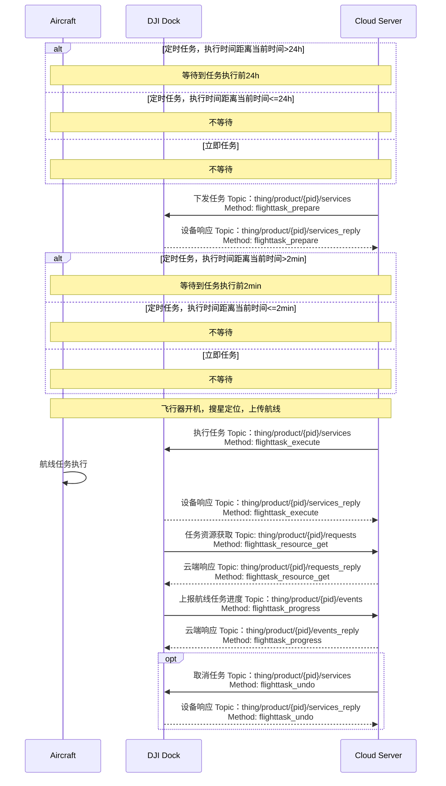

## 功能概述

航线管理是无人机自主作业的重要功能，可以实现行业领域的批量化、智能化作业。上云 API 提供了相关的接口，实现了航线任务在云端的共享、查看、下发、执行、取消以及进度上报等功能。用户需要遵照[航线文件格式规范（WPML）](https://developer.dji.com/doc/cloud-api-tutorial/cn/specification/dji-wpml/overview.html)编写航线文件，定义航线任务。一个航线任务中可以定义多条航线。

通过航线管理接口，用户可以通过航线文件信息指定航线任务、任务开始执行的时间、任务类型与航线类型，完成任务的下发。每个航线任务给定一个"flight_id"，以id作为指引，可以确定需要执行与取消的航线任务，任务取消支持批量取消。航线任务进度可上报，云端可以获取到设备当前的进度信息（如当前执行到的步骤、进度百分比等）、扩展信息（如当前执行到的航点数等）。若用户想要获取航线任务的信息，借助“flight_id”指定，云端将返回该航线任务的航线文件信息，如文件签名、文件URL。

航线任务接口、接口中的字段、字段的解释请根据本页中的“接口详细实现”的指引查询。如果在使用航线管理功能的过程中出现了错误，请通过返回的错误码在[错误码](https://developer.dji.com/doc/cloud-api-tutorial/cn/server-api-reference/error-code.html)章节中查询对应的错误描述。

## 交互时序图

## 接口详细实现

> **注意：**
>
> * 我们已经将`创建航线任务`接口废弃，请使用`下发任务`与`执行任务`接口。
> * 若`task_type`任务类型指定为“立即执行”时，设备端限制了30s的时间误差，若设备收到指令的时间与`execute_time`相差超过30s，将报错且该任务无法正常执行。
> * 若设备正在执行航线任务的过程中，再次收到航线任务执行的指令，再次收到的航线任务不会执行并且设备将报错。

航线管理相关的API在文档中的查看路径：云端API > MQTT > 物模型 > 机场 > 航线管理

* **创建航线任务（已废弃）**
* **下发任务** 
  航线管理当前增加了"预发布"的概念，飞行任务的提前下发给机场与飞行器预留了一些准备时间。在`下发任务`接口调用后，还需要调用`执行任务`接口执行。在`下发任务`接口中为航线任务分配`flight_id`，凭借`flight_id`字段，可以对指定航线任务进行执行、取消、任务资源的获取等操作。
* **执行任务**
* **取消任务** 
  支持批量取消任务，仅能取消任务的下发，无法取消正在执行中的任务。
* **上报飞行任务进度** 
  航线任务执行进度可上报，上报信息包括进度信息以及拓展信息。
* **任务资源获取** 
  任务资源获取将返回`flight_id`对应航线任务的航线文件信息。

