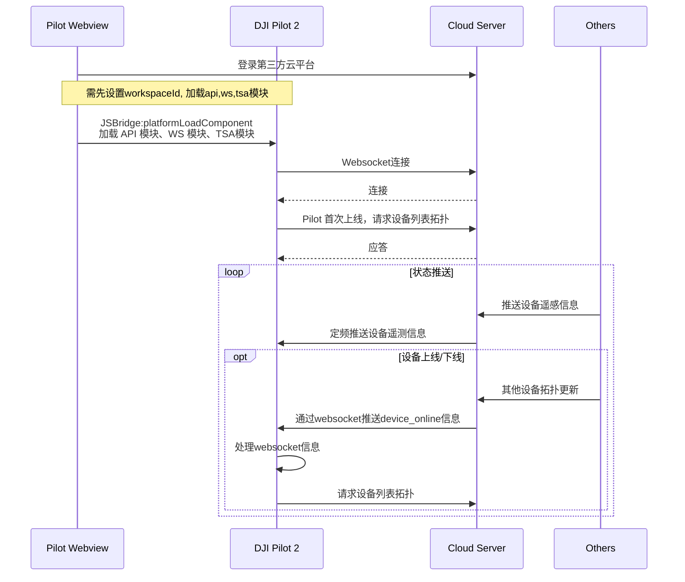

## 功能概述

态势感知功能主要是服务端可以推送设备（飞机/遥控器）坐标信息给到 Pilot 端， Pilot 会把推送过来的信息显示在地图中。这样就可以实现把同一个工作空间下的所有设备之间信息形成一张网，不止web端可以看到，飞手端也可以看到，从而有效的促进所有设备间的态势信息分享与沟通。

如下图所示，Pilot A 、Pilot B、 DOCK A、DOCK B通过上云API接口推送自身的设备拓扑和设备经纬度坐标给服务端，同时服务端也接收其他人员和设备的GPS信息，并把这些信息汇集到同一个工作空间，然后通过websocket把信息推送给Pilot， 这样Pilot A、Pilot B就可以在地图中看到整个工作空间下的所有人员和设备位置信息。

 <center>        <br>     </center>

## Pilot 交互时序图




## 接口详细实现

* [JSBridge](https://developer.dji.com/doc/cloud-api-tutorial/cn/api-reference/pilot-to-cloud/jsbridge.html)<br/>
  加载态势感知模块<br/>
  在使用态势感知功能之前，需要预先在H5页面中通过JSBridge设置好工作空间信息（workspaceId），配置好ws模块、api模块，然后加载Pilot2的tsa模块。开发者可以考虑在上下线登录阶段直接添加加载tsa模块的接口。

* [态势感知（HTTPS）](https://developer.dji.com/doc/cloud-api-tutorial/cn/api-reference/pilot-to-cloud/https/situation-awareness/obtain-device-topology-list.html)<br/>
  获取设备拓扑列表<br/>
  * Pilot 在首次上线后，会发送http请求去获取同一个工作空间下的所有设备列表及其拓扑，服务端需要把整个设备列表发给Pilot2。同时，当接收到websocket指令通知设备online/offline/update的时候，也是需要调用该接口进行请求设备拓扑列表进行更新。
  * 自定义图标<br/>
  设备可以显示自定义图标，使用字段 icon_urls 来定义，如果有定义该字段，则优先按该字段的内容来显示。如果没有则按device_model来默认显示。

```json
"icon_urls":{      
                "normal_icon_url":"resource://Pilot2/drawable/tsa_aircraft_others_normal",    // 正常状态下的图标
                "selected_icon_url":"resource://Pilot2/drawable/tsa_aircraft_others_pressed",   // 选中状态下的图标
            }
```

App内置了一些图标可供外部使用

```
url样式： resource://Pilot2/drawable/tsa_aircraft_others_normal
```

内置图标列表
| 图标样式                                                     | icon_url                                        | 备注 |
| ------------------------------------------------------------ | ----------------------------------------------- | ---- |
|  | resource://Pilot2/drawable/tsa_car_select       |      |
|  | resource://Pilot2/drawable/tsa_car_normal       |      |
|  | resource://Pilot2/drawable/tsa_person_select    |      |
|  | resource://Pilot2/drawable/tsa_person_normal    |      |
|  | resource://Pilot2/drawable/tsa_equipment_select |      |
|  | resource://Pilot2/drawable/tsa_equipment_normal |      |


同时也可以定义网络上的图标，App内部下载缓存这些图标，并以固定大小(28dp)加载显示到地图上。

```
url样式：http://r56978dr7.hn-bkt.clouddn.com/tsa_equipment_normal.png
```

Pilot 地图中显示的图标如下图所示：

<center>        <br>     </center>

* [态势感知（WebSocket）](https://developer.dji.com/doc/cloud-api-tutorial/cn/api-reference/pilot-to-cloud/websocket/situation-awareness/message-push.html) 与 [遥控器设备管理](https://developer.dji.com/doc/cloud-api-tutorial/cn/api-reference/pilot-to-cloud/mqtt/rc-plus/properties.html)<br/>
  * 其他设备会推送遥感信息给到服务器端，同时服务端定频推送同一个工作空间下的所有设备遥感信息给 Pilot 端， Pilot 会根据接收到的数据实时更新地图中设备状态和位置。
  * 设备上线/下线推送<br/>
  当服务端接收到同一个工作空间下的任意设备拓扑更新的请求后，同时也通过websocket广播一条设备更新拓扑的推送给到 Pilot 端， Pilot 收到该推送后，会触发“获取设备拓扑列表”。
