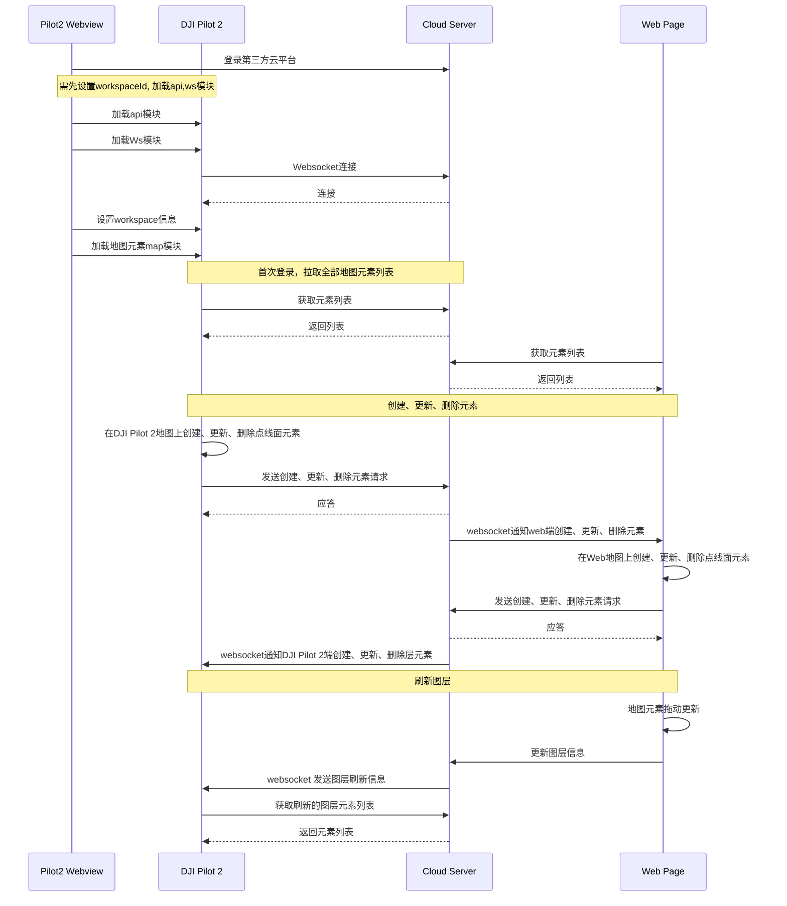

## 功能概述

地图元素功能集主要是把DJI Pilot 2地图界面上的点线面元素可以同步到云服务端，最终实现指挥官在web页面画点线面标记，可以实时同步给Pilot端的飞手，这样实现实时的战术指挥。当然，飞手看到可疑目标，也可以在DJI Pilot 2的地图上打点或画线面，这个信息也会实时同步给Web端。

同时，云平台可以在接收到A飞机的DJI Pilot 2地图元素信息后，同步给B飞机的DJI Pilot 2，这样实现不同飞手之间的地图元素信息共享。

> **注意：**
>
> 1. 只有在设置完工作空间workspace时，Pilot2才会开始同步workspace下的元素，因此设置workspace是必要的。
> 2. *同一台飞机的AB控会自动进行地图元素同步，无需经过服务端转发。*
> 3. 如果A控没有连服务器，B控连服务器，则A控新增的点会先同步到B控，再由B控同步到服务器。
> 4. *地图元素的经纬度坐标采用了WGS84坐标系，如果Web端采用的是百度、高德地图等，需要做坐标转换。*

 
              

          
DJI Pilot 2上地图元素显示
    

          
Web端地图元素显示
    

## 交互时序图

## 接口详细实现

* [JSBridge](https://developer.dji.com/doc/cloud-api-tutorial/cn/api-reference/pilot-to-cloud/jsbridge.html) 
  加载地图元素模块 
  在使用地图元素功能之前，需要预先在H5页面中通过JSBridge设置好工作空间信息（workspaceId），配置好ws模块和api模块，然后加载DJI Pilot 2的map模块。开发者可以考虑在上下线登录阶段直接添加加载map模块的接口。

* [地图元素（HTTPS）](https://developer.dji.com/doc/cloud-api-tutorial/cn/api-reference/pilot-to-cloud/https/map-elements/create.html)
  * 获取地图元素列表 
  DJI Pilot 2在首次上线后，会发送http请求去获取地图元素列表，服务端需要把共享的地图元素列表发给DJI Pilot 2。同时，当接收到websocket指令进行图层刷新的时候，也是需要调用该接口进行请求地图元素列表。
 
  > **注意：列表里需要有App共享图层，否则后继元素修改将无法同步到服务器。**

  * 创建地图元素 
  当用户在DJI Pilot 2或Web端画点线面时，DJI Pilot 2或Web会向服务端发送一条新增地图元素的请求。服务端收到请求后，进行应答。

  * 更新地图元素 
  当用户在DJI Pilot 2或Web端编辑点线面时，Pilot2或Web会向服务端发送一条更新地图元素的请求。服务端收到请求后，进行应答。

  * 删除地图元素 
  当用户在DJI Pilot 2或Web端删除点线面时，DJI Pilot 2或Web会向服务端发送一条删除地图元素的请求，服务端收到请求后，进行应答。

* [地图元素（WebSocket）](https://developer.dji.com/doc/cloud-api-tutorial/cn/api-reference/pilot-to-cloud/websocket/map-elements/message-push.html) 
  消息发布
  * 刷新图层元素列表推送 
  当服务端有多个图层中的元素都变动时,例如web端拖动地图元素，可以通过websocket通知客户端进行元素列表刷新，下发的参数中带有图层的group_id，然后客户端接收到这个id之后，在通过http调用 “获取地图元素列表”的请求，进行元素列表的更新。
  * 新增/更新/删除地图元素推送  
  服务端接收到DJI Pilot 2/Web端发送过来的新增/更新/删除地图元素请求后，会更新服务端存储的地图元素，并把改动的地图元素通过websocket通知在同一个workspace下的各个终端。
