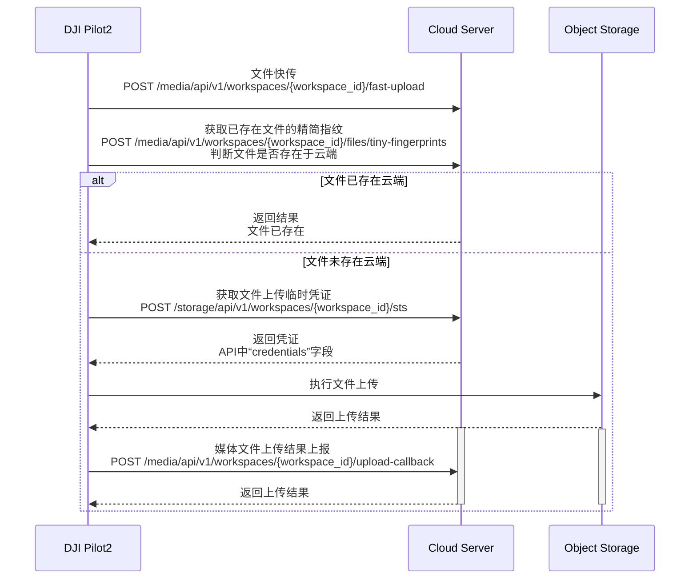

## 功能概述

媒体库功能集主要是DJI Pilot 2或大疆机场把飞行器上的媒体文件（图片/视频）下载到遥控器/机场的本地存储，然后再通过网络上传到三方服务器的过程。媒体上传包含自动上传和手动上传功能。

我们提供了媒体文件上传功能的Demo，实现效果可以点击[功能预览视频](https://developer.dji.com/doc/cloud-api-tutorial/cn/quick-start/function-display-video.html)查看视频。通过该视频可以了解到如何进行对象存储的配置、如何打开自动上传开关、文件自动上传与手动上传的操作流程等。

              

## 交互时序

## 接口详细实现

* [JSBridge](https://developer.dji.com/doc/cloud-api-tutorial/cn/api-reference/pilot-to-cloud/jsbridge.html) 
  加载Media媒体库模块 
  在使用媒体库模块功能之前，需要预先在H5页面中通过JSBridge设置好工作空间信息（workspaceId），配置好api模块，然后加载DJI Pilot 2的media模块。开发者可以考虑在上下线登录阶段直接添加加载media模块的接口。

* [媒体管理（HTTPS）](https://developer.dji.com/doc/cloud-api-tutorial/cn/api-reference/pilot-to-cloud/https/media-management/fast-upload.html)
  * 文件快传 
  由于传输文件时可能会存在云端已有的图片，那么DJI Pilot 2或机场在上传文件时，会启动文件快传接口，服务端需要检查该文件是否已经上传存在了，如果存在了，直接返回上传成功。

  * 获取已存在文件的精简指纹  
  通过精简指纹校验，确认文件是否已经上传

  * 获取上传临时凭证 
  每次媒体上传时，需要向服务端获取临时文件上传凭证，这样DJI Pilot 2在上传时会带上该凭证给对象存储服务进行校验。 

  * 媒体文件上传结果上报 
  媒体文件传输结束后，DJI Pilot会调用该接口向服务端告知对应的媒体文件上传结果。

  * 文件组上传完成后回调
