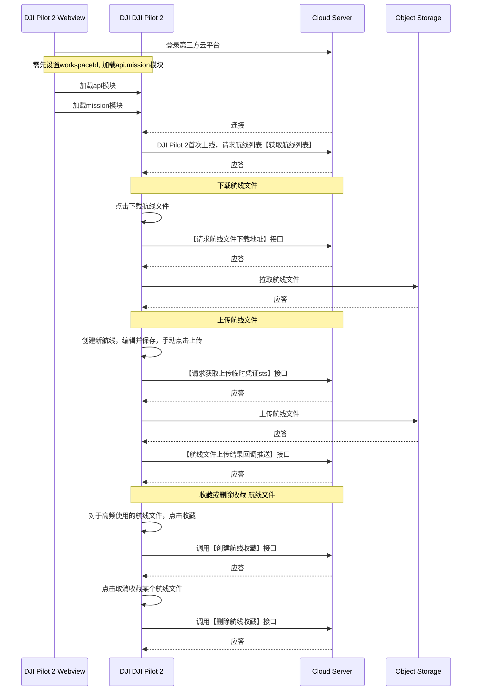

## 功能概述

航线管理功能主要是提供同一个工作空间下的航线文件下载上传的能力，当用户通过DJI Pilot 2登录到服务端之后，可以拉取航线列表，并显示在DJI Pilot 2的航线库中，DJI Pilot 2中可以直接预览云端存在的航线，但是当用户需要编辑航线的时候，需要把航线下载到DJI Pilot 2本地进行编辑，本地编辑的内容不影响云端的航线，如果编辑后的航线需要共享，则需要重命名一个新航线，再发起上传的动作。此处要注意，如果从服务端拉取航线到DJI Pilot 2本地进行编辑，那么编辑之后保存的航线为新的航线，需要对新航线进行重命名，不然会出现传输失败的情况。

              

我们提供了[航线文件格式规范](https://developer.dji.com/doc/cloud-api-tutorial/cn/api-reference/dji-wpml/overview.html)。用户遵照规范编写航线文件，可以明显降低开发门槛。

## 交互时序图

## 接口详细实现

* [JSBridge](https://developer.dji.com/doc/cloud-api-tutorial/cn/api-reference/pilot-to-cloud/jsbridge.html) 
  加载Mission航线模块 
  在使用航线模块功能之前，需要预先在H5页面中通过JSBridge设置好工作空间信息（workspaceId），配置好api模块，然后加载DJI Pilot 2的mission模块。开发者可以考虑在上下线登录阶段直接添加加载mission模块的接口。

* [航线管理（HTTPS）](https://developer.dji.com/doc/cloud-api-tutorial/cn/api-reference/pilot-to-cloud/https/waypoint-management/obtain-waypointfile-list.html)
  * 获取上传临时凭证 
    每次航线文件上传时，需要向服务端获取临时文件上传凭证，这样DJI Pilot 2在上传时会带上该凭证给对象存储服务进行校验。

  * 获取航线文件列表 
    DJI Pilot 2在加载Mission航线模块之后，会通过http向服务端拉取航线文件列表，并显示在DJI Pilot 2航线库中。

  * 获取航线文件下载地址 
    当用户点击下载DJI Pilot 2中航线列表的某个航线时，DJI Pilot 2会发起获取航线下载地址的请求。

  * 获取重复的航线文件名称 
    DJI Pilot 2在本地编辑和上传的航线文件中，不允许有重复的航线名称存在，所以在上传航线文件时，需要先调用该接口，检查是否存在重复的航线文件名称，如果存在重复的航线文件名称，则会弹窗提示用户重命名航线文件名称。

  * 航线文件上传结果上报 
    航线文件上传到对象存储服务以后，DJI Pilot 2会把上传结果上报给服务端，服务端对该结果进行相应的业务操作。

  * 批量收藏航线文件 
    当用户需要特别关注某几个航线文件时，可以点击收藏，同时，通过该接口可以标记需要收藏的航线文件与该用户的绑定关系。

  * 批量取消收藏航线文件 
    同上功能，取消航线文件与用户的收藏绑定关系。
