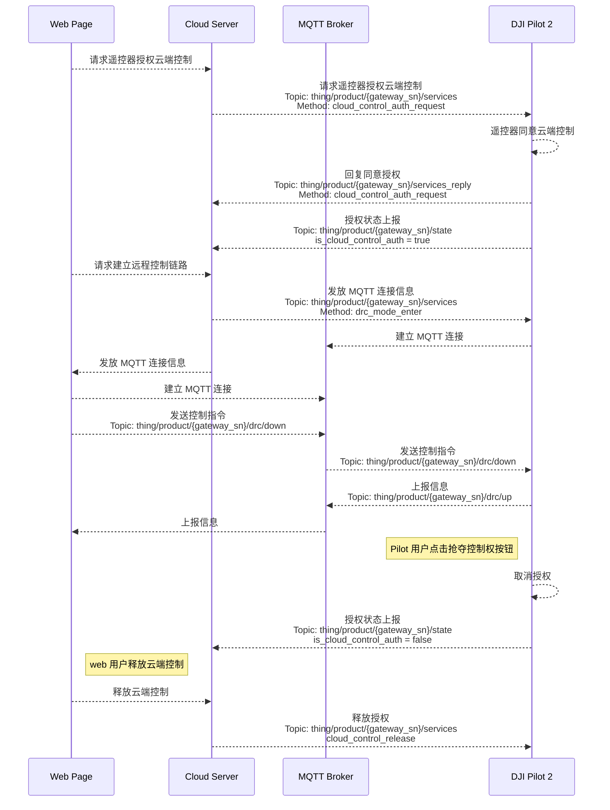

## 功能概述 

Pilot 上云开放远程控制功能，云端用户可以通过 Pilot 操控飞行器云台和负载，实现看向特定位置、拍照、录像、红外测温等功能，支持飞行器的 OSD 和避障信息上报。目前仅支持控制 Mavic 3 行业系列机型，并且**不区分飞行和负载控制权**。

* 飞行控制类指令（DRC）
  
  DRC（drone remote control）使用 MQTT 协议，并新增两个 Topic 表示上行与下行。[MQTT Topic 定义](https://developer.dji.com/doc/cloud-api-tutorial/cn/api-reference/dock-to-cloud/mqtt/topic-definition.html)中对新增 drc Topic 结构体提供了介绍与示例。云端与设备成功建立 MQTT 连接以后，将分配一个 EMQX Broker 专门用于云端到设备端的 DRC 通信链路，使得传输与响应更快。DRC 指令需要提前开启指令飞行控制模式才能使用。DRC 指令一般不受飞行控制权的限制，但 `DRC-飞行控制 Method: drone_control`的使用必须有控制权。

图. DRC 链路

* 负载控制类指令：负载控制类指令都需要控制权。当前负载控制类指令控制相机与云台的动作，实现相机的拍照录像、相机变焦、云台重置等负载操作，从而获取目标的信息。

## 交互时序图

> **注意：** 建议在下发指令飞行 API 前执行控制权抢夺，以防多方同时对飞行器发送指令导致飞行器故障。

## 接口详细说明

> **说明：** 需要在 DJI Pilot 界面上开启 “媒体上传”，通过负载控制指令拍摄的媒体文件才会被媒体管理功能上传。如何开启媒体上传可以[参考 《大疆司空 2 使用说明》中的 “媒体库” 章节](https://fh.dji.com/user-manual/cn/media-files.html)。

[指令飞行](https://developer.dji.com/doc/cloud-api-tutorial/cn/api-reference/pilot-to-cloud/mqtt/rc-pro/drc.html)

* 飞行控制类指令（DRC 指令）
* 负载控制类指令

[远程控制](https://developer.dji.com/doc/cloud-api-tutorial/cn/api-reference/pilot-to-cloud/mqtt/rc-pro/remote-control.html)
