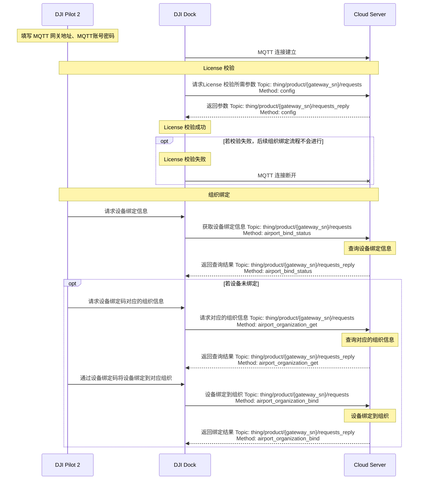

## 概述

机场上云需要借助遥控器内安装的 DJI Pilot 2。如下图示，开发者可按照 Pilot 内的指示一步步操作完成上云。在上云过程中，需要完成设备的检查（如急停按钮的检查、网络是否已经连接等）、将飞行器与机场对频、填写上云配置信息（如填写 MQTT 账号密码以实现 MQTT 连接）等操作。通过 Demo 中的机场上云部分，可以获得机场上云操作的演示，演示视频请查看 [功能预览视频](https://developer.dji.com/doc/cloud-api-tutorial/cn/quick-start/function-display-video.html) 中的机场上云。

机场上云需要校验 License。License 来源为[开发者网站](https://developer.dji.com/user/apps/#all)的 Cloud API 类型的 App 申请，申请结果如图示。申请成功以后，开发者可以被判定为 DJI 授权的开发者。

> **注意：**
>
> * 当 DJI Pilot 2 与机场在接入第三方云时，对于安全性要求比较高的场景中，需要对通信链路进行加密，实现数据的安全通信。SSL 链路默认设备会认证服务端，服务端不认证设备端。若服务端开启设备认证，需要在服务端进行 “clientAuth” 的配置。
> * DJI Pilot 2 与机场支持 Godaddy 颁发的证书，若开发者需要做数据安全加密，可以使用与大疆相同的认证机构证书即可实现 MQTT SSL 认证。

## 交互时序

## 接口详细实现

* [Pilot 安装包获取](https://sdk-forum.dji.net/hc/zh-cn/articles/6177232395801-Pilot2-%E6%80%8E%E4%B9%88%E5%AE%89%E8%A3%85-%E5%93%AA%E9%87%8C%E8%83%BD%E5%A4%9F%E8%8E%B7%E5%8F%96%E5%88%B0%E5%AE%89%E8%A3%85%E5%8C%85-)

* [配置更新](https://developer.dji.com/doc/cloud-api-tutorial/cn/api-reference/dock-to-cloud/mqtt/dock/dock1/config.html)
  * 获取配置 

* [组织管理](https://developer.dji.com/doc/cloud-api-tutorial/cn/api-reference/dock-to-cloud/mqtt/dock/dock1/organization.html)
  * 获取设备绑定信息
  * 查询设备绑定对应的组织信息 
    若设备绑定成功，机场与飞行器将被绑定到设备绑定码对应的组织。开发者可以自行设计如何通过在 Pilot 端填写的设备绑定码与组织 ID 以校验得到组织名称用于绑定。在我们提供的机场上云的 Demo 中，默认填写了设备绑定码，仅作为参考。
  * 使用设备绑定码绑定对应组织
