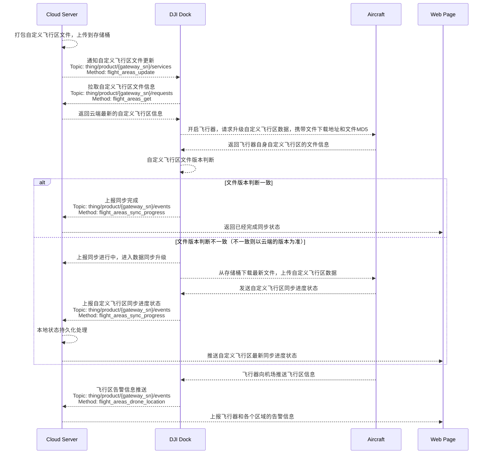

## 功能概述

上云 API 开放自定义飞行区功能。用户可以将敏感地点设定为禁飞区，并将这些信息同步给项目内的大疆机场。当无人机执行任务时，它会自动绕行禁飞区，从而确保作业的安全和规范性。本功能通过自定义飞行区文件圈定飞行器的飞行区域，**点击下载[自定义飞行区文件协议模板](https://terra-1-g.djicdn.com/fee90c2e03e04e8da67ea6f56365fc76/SDK%20%E6%96%87%E6%A1%A3/CloudAPI/custom-flight-area-file-template.json)**。

该功能支持用户在地图上规划自定义飞行区。自定义飞行区包括两种类型：

1. 自定义作业区：在自定义作业区内，飞行器可以起飞并进行作业，但无法飞出该区域。
2. 自定义限飞区：在自定义限飞区外，飞行器可以进行作业，但无法飞入该区域。

## 交互时序图

## 接口详细实现

[自定义飞行区](https://developer.dji.com/doc/cloud-api-tutorial/cn/api-reference/dock-to-cloud/mqtt/dock/dock2/custom-flight-area.html)
