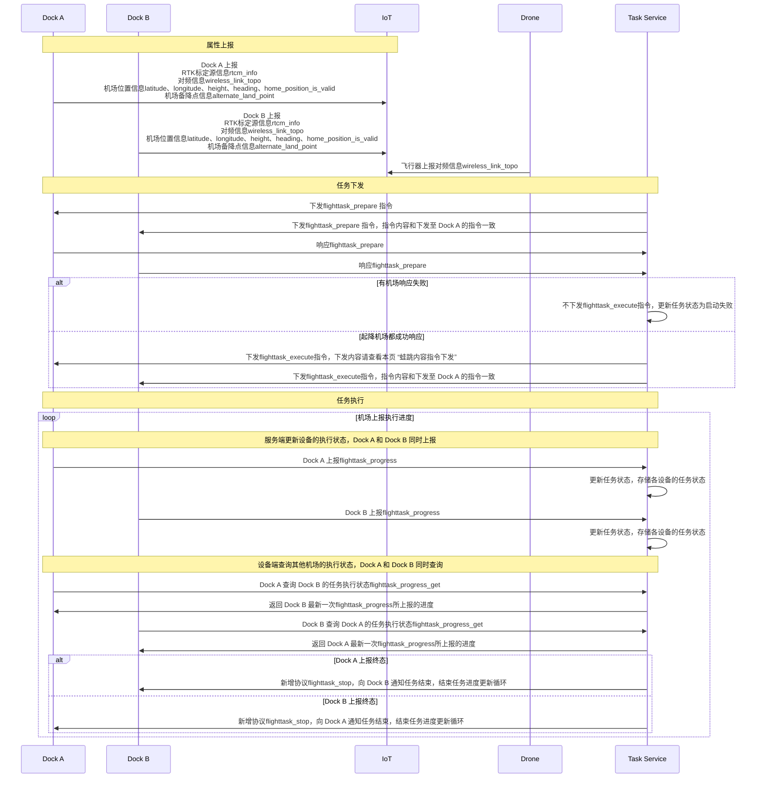

## 功能概述

大疆机场 2 支持用户下发蛙跳任务，通过任务执行指令配置任务的起飞机场和降落机场，以支持飞行器在不同的机场间起降。

### 蛙跳任务指令下发

当按照时序图执行到任务下发阶段，如果起降机场都成功响应了，就可以下发 `flighttask_execute` 指令开始蛙跳任务了。对`flighttask_execute` 指令中的关键参数介绍如下：
新增 `multi_dock_task` 字段，用来配置和校验起降机场的参数，其中：
* `dock_infos` 字段为起降机场参数，需要将选取执行蛙跳任务的两个机场分别作为起降机场。
  * 起飞机场中 `dock_type` 字段设为 "takeoff"，`sn` 字段为起飞机场设备序列号，`index` 字段为该机场在本次任务中的唯一标识，其余字段填充为该起飞机场对应的设备属性最新上报值。
  * 降落机场中 `dock_type` 字段设为 "landing"，其他字段填充方法与起飞机场一致，需保证index不能重复。
* `wireless_link_topo` 字段为实现飞行器和两个机场的对频需要组装三个设备的对频信息，其中`secret_code`和`center_node` 字段填充为飞行器设备属性 `wireless_link_topo` 中的相应字段值，`leaf_nodes` 字段需要区分起飞降落机场的对频信息分别填入，`sdr_id`和`sn`字段分别填入起飞机场和降落机场，起飞机场的 `control_source_index` 字段来源于机场设备属性，降落机场的`control_source_index`需要和起飞机场相反，如起飞机场`control_source_index`上报为1，则降落机场该参数填入2，反之亦然。

**说明：**
* 执行蛙跳任务的两个机场必须使用同源的网络 RTK 服务进行标定，且[航线精度类型 `wayline_precision_type` 建议选择 “高精度 RTK 任务”](https://developer.dji.com/doc/cloud-api-tutorial/cn/api-reference/dock-to-cloud/mqtt/dock/dock2/wayline.html)，否则有炸机风险。

* 需保证蛙跳任务执行时刻，起飞机场内必须存在飞行器。

* 蛙跳任务执行过程中，若飞行器触发了返航逻辑或用户手动下发返航指令，飞行器会根据电量及机场位置自主选择返航目标机场，计划降落机场的优先级高于起飞机场，飞行器会默认将计划降落机场作为返航目标机场。当计划降落机场不可达时，才会将起飞机场作为返航目标机场。若执行航线过程中，用户想指定机场作为返航的目标机场，可以使用新增协议 `return_specific_home`。

* 蛙跳任务执行过程中若碰到限高区会返航，执行默认返航逻辑，高度判断使用的是相对起飞机场的高度，其他限飞区逻辑与普通航线任务一致。
 
* 蛙跳任务执行过程中，发起飞行器直播 `live_start_push` 指令的 Topic 中的 *{gateway_sn}* 应以当前飞行器上报的 `best_link_gateway` 字段为准。而且为了飞行器码流保持连续，在飞行器 `best_link_gateway` 属性发生变化时，需要以最新 `best_link_gateway` 属性中推送的网关 sn 为 `live_start_push` 指令的 topic 中的 *{gateway_sn}*，重新下发`live_start_push` 指令。

* 蛙跳任务执行过程中，对飞行器的下行指令下发，如暂停/恢复/返航等指令，同直播指令一致，指令的 topic 中的 *{gateway_sn}* 应以当前飞行器上报的 `best_link_gateway` 为准。

* 执行蛙跳任务时，当已经设置了起飞和降落机场，此时 B 控遥控器的连接会被挤占而断开。

## 交互时序图

IoT 表示服务端物联网层，用于设备接入，维护设备状态，Task Service表示服务端上层业务系统，用于设备任务管理，下发任务指令。

## 接口详细实现

* [机场设备属性](https://developer.dji.com/doc/cloud-api-tutorial/cn/api-reference/dock-to-cloud/mqtt/dock/dock2/properties.html)
  * wireless_link_topo（必需）
  * rtcm_info（必需）
  * latitude（必需）
  * longitude（必需）
  * height（必需）
  * heading（必需）
  * home_position_is_valid（必需）
  * alternate_land_point（必需）
* [飞行器设备属性](https://developer.dji.com/doc/cloud-api-tutorial/cn/api-reference/dock-to-cloud/mqtt/aircraft/m3d-properties.html)
  * wireless_link_topo（必需）
  * best_link_gateway
* [航线管理](https://developer.dji.com/doc/cloud-api-tutorial/cn/api-reference/dock-to-cloud/mqtt/dock/dock2/wayline.html)
  * Service
    * flighttask_execute（必需）
    * flighttask_stop（必需）
    * return_specific_home
  * Requests
    * flighttask_progress_get（必需）
  * Events
    * return_home_info
