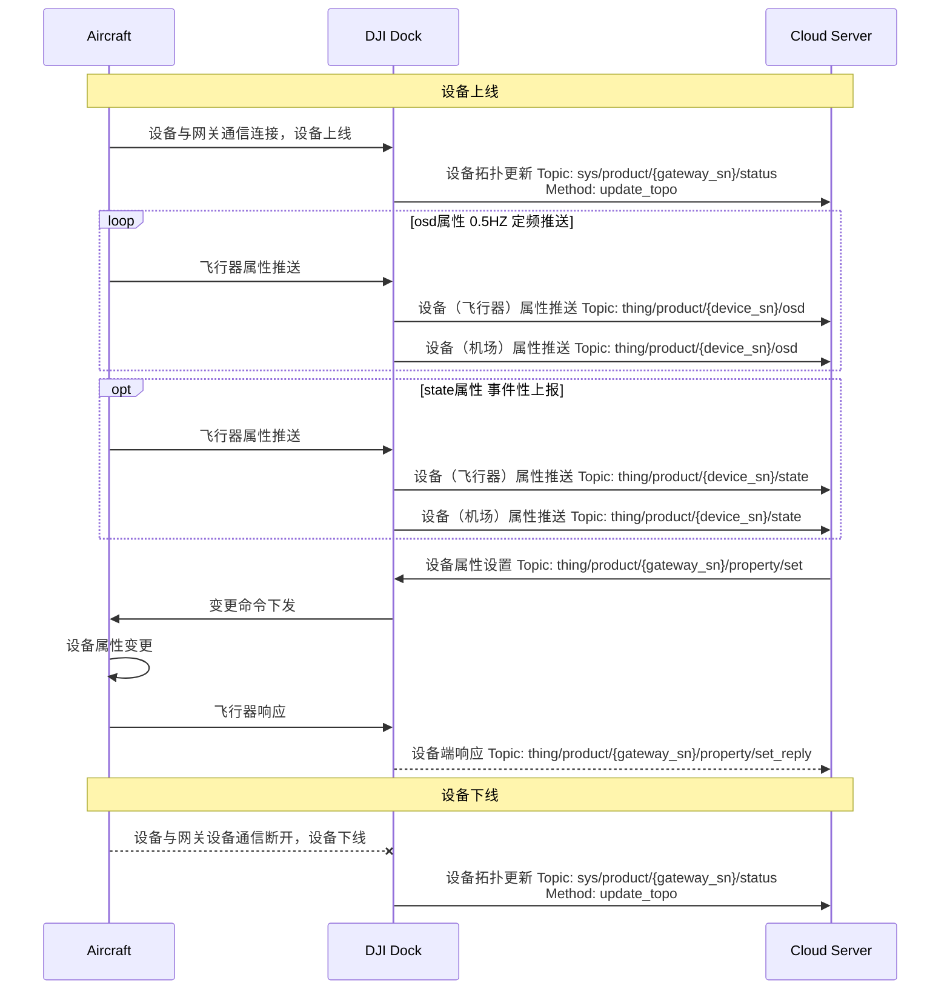

## 功能概述
设备管理功能支持设备向云端上报拓扑信息、推送设备属性、以及云端对设备的属性进行设置。让用户可以在云端查看以及调整设备状态，更为方便地展开工作。

## 交互时序图

## 接口详细实现

* [飞行器设备属性](https://developer.dji.com/doc/cloud-api-tutorial/cn/api-reference/dock-to-cloud/mqtt/aircraft/properties.html)

* [机场设备属性](https://developer.dji.com/doc/cloud-api-tutorial/cn/api-reference/dock-to-cloud/mqtt/dock/dock1/properties.html)

* [设备管理（MQTT）](https://developer.dji.com/doc/cloud-api-tutorial/cn/api-reference/dock-to-cloud/mqtt/dock/dock1/device.html)
  * 设备拓扑更新 
    网关设备感知到与子设备通信的连接与断开，会向云端上报子设备的上下线状态。协议中`type`与`sub_type`的值请参照[产品支持](https://developer.dji.com/doc/cloud-api-tutorial/cn/overview/product-support.html)章节找到对照。

   * 设备属性推送 
    设备属性划分为定频数据（osd）与状态数据（state），osd 属性会以 0.5 HZ定频上报，state属性会在属性变化时上报。不同的设备属性我们提供了不同的处理策略，使用不同的topic上报。设备属性分别介绍在：[飞行器设备属性](https://developer.dji.com/doc/cloud-api-tutorial/cn/api-reference/dock-to-cloud/mqtt/aircraft/properties.html)、[机场设备属性](https://developer.dji.com/doc/cloud-api-tutorial/cn/api-reference/dock-to-cloud/mqtt/dock/dock1/properties.html)与[遥控器设备属性](https://developer.dji.com/doc/cloud-api-tutorial/cn/api-reference/dock-to-cloud/mqtt/aircraft/properties.html)章节。

  * 设备属性设置 
    * 当前设备属性的设置没有实现全面覆盖，我们将在后续逐渐实现。
    * 在设备属性章节中通过“accessMode”标识属性的读写状态，标识为“rw”表示属性可以被设置。
    * 设备属性设置只支持单个属性字段的设置。譬如`飞机限远状态（distance_limit_status）`属性包括`是否开启限远（state）`和`限远距离（distance-limit）`两个字段。在做飞机限远状态的属性设置时，设置指令需要发送两次。
