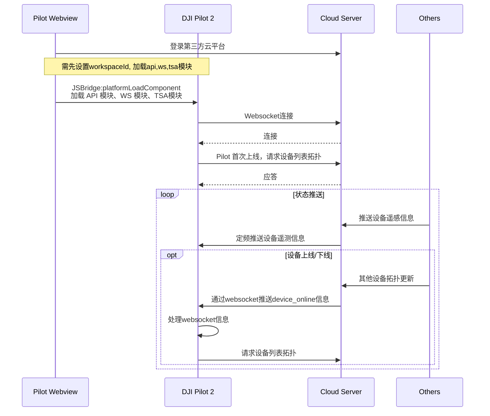
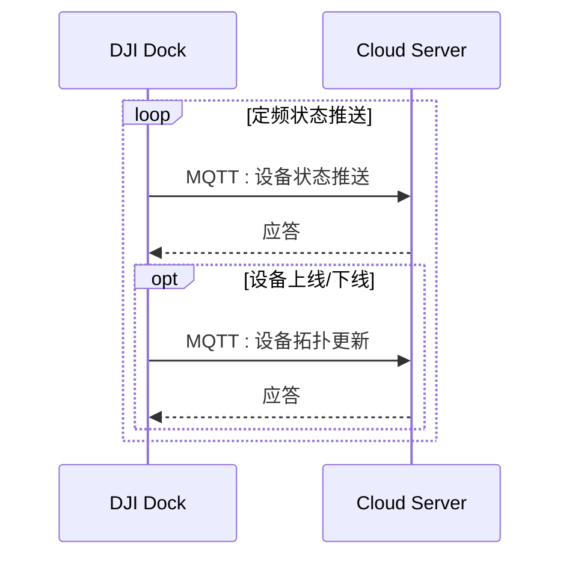

## 功能概述

态势感知功能主要是服务端可以推送设备（飞机/遥控器）坐标信息给到DJI Pilot 2端，DJI Pilot 2会把推送过来的信息显示在地图中。这样就可以实现把同一个工作空间下的所有设备之间信息形成一张网，不止web端可以看到，飞手端也可以看到，从而有效的促进所有设备间的态势信息分享与沟通。

如下图所示，Pilot A 、Pilot B、 DOCK A、DOCK B通过上云API接口推送自身的设备拓扑和设备经纬度坐标给服务端，同时服务端也接收其他人员和设备的GPS信息，并把这些信息汇集到同一个工作空间，然后通过websocket把信息推送给Pilot， 这样Pilot A、Pilot B就可以在地图中看到整个工作空间下的所有人员和设备位置信息。

 
              

## Pilot 交互时序图

## 机场交互时序图

## 机场接口详细实现

### 设备状态推送
机场会定频推送设备状态到服务器，使用到的API：云端API > MQTT > 设备管理 > 设备状态推送。

### 设备上线/下线推送
如果存在上线、下线行为，机场会向服务器发起设备拓扑更新，使用到的API：云端API > MQTT > 设备管理 > 设备拓扑更新。

