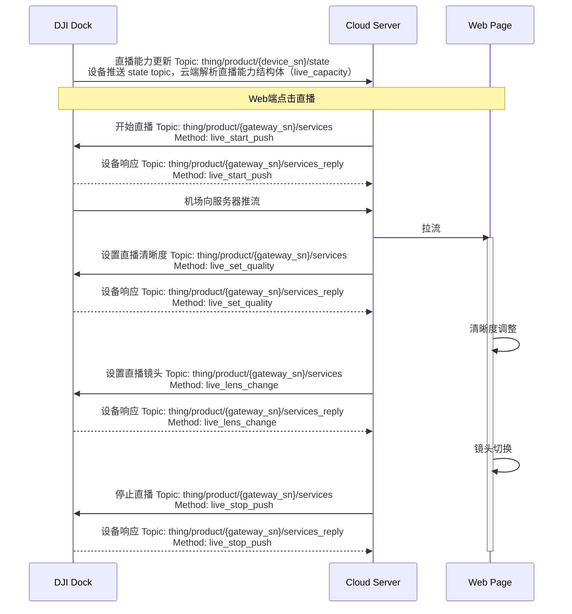

## 功能概述

直播功能主要是把无人机相机负载和大疆机场的视频码流发给第三方云平台进行播放，用户可以方便的在远程web页面点击直播。直播功能支持直播的开始、停止、清晰度设置、镜头切换。

### 支持的直播类型

| 直播类型  | 描述                                                         |
| --------- | ------------------------------------------------------------ | 
| Agora声网 | 声网 Agora 成立于 2013 年，是实时音视频云行业开创者和全球领先的专业 PaaS 服务商。 开发者只需简单调用 Agora API，30 分钟即可在应用内构建多种实时音视频互动场景。 大疆司空2也是基于声网的“极速直播”功能进行码流推送，整体直播延迟比较低，效果好。 对于三方云私有化部署，Agora 也提供了混合云部署模式，码流和数据都在客户的私有服务器中，然后通过网闸打通一个链路到 Agora 的运维公有云，这个链路通道主要是用来对私有化部署的服务进行升级和运维。 | 
| RTMP      | RTMP是 Real Time Messaging Protocol（实时消息传输[协议](https://baike.baidu.com/item/协议/13020269)）的首字母缩写。该协议基于 TCP，是一个协议族，包括 RTMP 基本协议及 RTMPT/RTMPS/RTMPE 等多种变种。RTMP 是一种设计用来进行实时数据通信的网络协议，主要用来在 Flash/AIR 平台和支持 RTMP 协议的流媒体/交互服务器之间进行音视频和数据通信。  |  
| GB28181   | GB/T 28181-2016 是中国大陆地区对于安防视频设备接入平台的一种传输控制规范，对于已有 28181 下联网关的服务器，可以直接通过该协议把 DJI 行业设备的码流推到服务器中。 |
| WebRTC/WHIP   | WebRTC [（Web Real-Time Communication）](https://docs.dolby.io/streaming-apis/docs/webrtc-whip)是一种支持网页浏览器进行实时视频和音频流的通信技术，它提供接近实时的音视频流，确保用户体验的流畅性。该技术广泛应用于在线会议、在线教育、远程医疗等高实时通信的场景。 WHIP [（WebRTC-HTTP Ingestion Protocol）](https://millicast.medium.com/whip-the-magic-bullet-for-webrtc-media-ingest-57c2b98fb285)是一个基于 HTTP 的协议，旨在为 WebRTC 发布者和流媒体服务器之间提供一个标准化的信令协议，以便于将 WebRTC 流引入流媒体服务器。它允许基于 WebRTC 的内容输入到流媒体服务器或 CDN 中。|

### 机场直播总体框架

 如上图所示，无人机飞行平台并不直接连接第三方云平台，中间是通过DJI Pilot 2或大疆机场进行转流转发，遥控器和机场与无人机之间的通信还是用DJI私有图传ocusync链路。

 第三方云平台需要预先部署MQTT网关以及流媒体服务器，DJI推流协议支持 Agora/RTMP/GB28181 等模式，其中MQTT网关主要用来做消息通信，配置信息设置和读取。

## 交互时序图

## 接口详细实现

[直播功能（MQTT）](https://developer.dji.com/doc/cloud-api-tutorial/cn/api-reference/dock-to-cloud/mqtt/dock/dock1/live.html)
* 直播能力更新 
  live_capacity（直播能力）字段是放在网关设备的物模型中的，同时只有当设备端有状态变化时推送。直播能力字段包含可用于直播的视频流总数、可同时进行直播的视频流总数、设备直播能力列表等信息。
* 开始直播 
  服务端下发`开始直播`指令，指令中指定使用的协议类型、直播质量等信息。直播视频流推流、拉流。
* 停止直播
* 设置直播清晰度 
  直播质量可设置，枚举值可在API章节查看。
* 设置直播镜头 
  直播功能可以在不影响直播进程的情况下，切换镜头。直播视频流的镜头类型枚举值，可在API章节自行查看。
 
