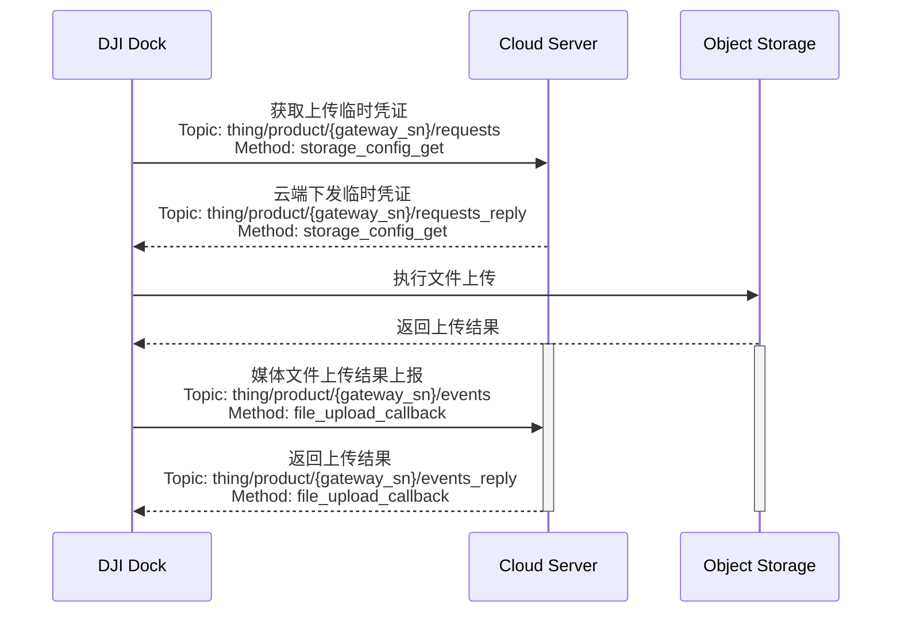

## 功能概述

媒体库功能集主要是DJI Pilot 2或大疆机场把飞行器上的媒体文件（图片/视频）下载到遥控器/机场本地存储，然后再通过网络上传到三方服务器的过程。媒体上传包含自动上传和手动上传功能，对于机场只有自动上传功能。

使用最新版本大疆机场 2 的固件：
* 产生的视频文件（红外、可见光、分屏三种视频文件）中会包含飞行器的位置和高度、云台姿态等信息（和旧固件中随视频文件产生的 SRT 字幕文件中的信息内容一致）。
* 完成一个航线飞行任务后，飞行器在 SD 卡中产生的 PPK 文件（.obs、.rtk、.mrk、.nav）和 RTCM 数据（.dat 格式）也会跟随媒体文件一起上传回云端存储桶。

              

## 交互时序

## 接口详细实现

[媒体管理（MQTT）](https://developer.dji.com/doc/cloud-api-tutorial/cn/api-reference/dock-to-cloud/mqtt/dock/dock1/file.html)
* 获取临时凭证 
  每次媒体文件上传时，需要向服务端获取临时文件上传凭证，这样机场在上传时会带上该凭证给对象存储服务进行校验。
* 媒体文件上传结果上报 
  媒体文件传输结束后，机场会调用该接口向服务端告知对应的媒体文件上传结果。

