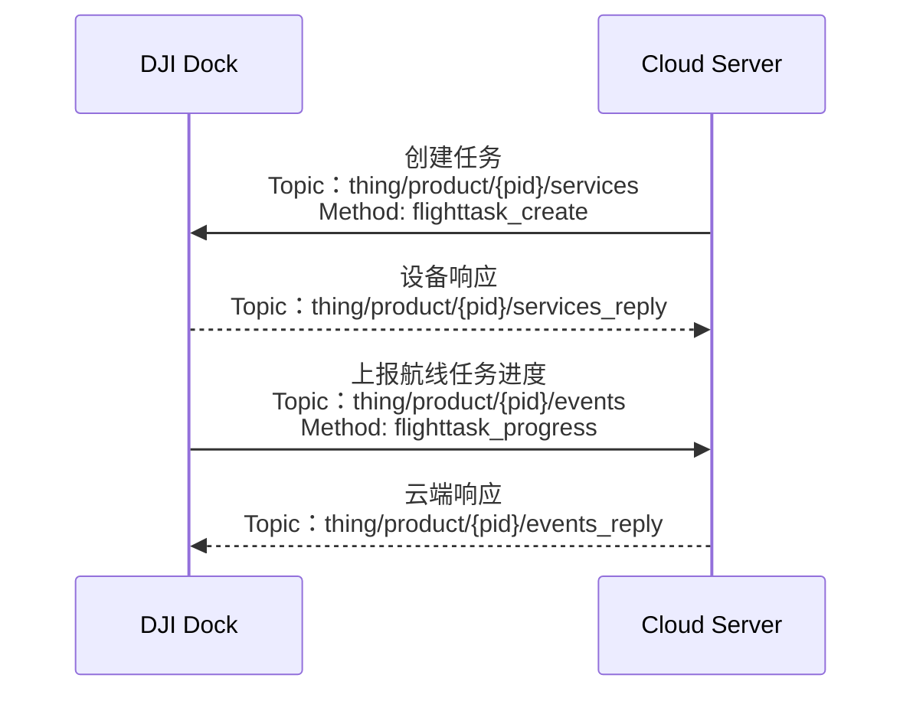

## 功能概述

为了云端的航线文件可以组合在一次任务中执行，并且可以在云端对该组航线进行查看、共享等，上云 API 开放了航线管理的功能。用户可以自行规划云端 WebView 界面，通过手动触发航线执行的循环、单/多次执行、执行机型指定、航线执行可视化等航线管理相关行为。当前仅能通过机场实现航线管理功能。

航线管理功能中，云端和设备的交互上较为简单。云端创建任务下发给设备，指定任务使用的航线任务以及执行任务的设备，设备响应并定频上报任务执行进度。

云端下发给设备的`创建任务`的指令中，需要提供航线文件的url存储地址以及用于校验的文件签名。设备`上报任务执行进度与状态`时，通过协议中的`status`字段可以查看任务执行状态，`current_step`字段可以对照枚举值查看当前执行动作，`percent`字段获得当前任务执行进度百分比。协议中的字段详细介绍请根据本节中的`接口详细实现`去查阅`云端API`对应章节。以上是对相关字段的简单介绍，如果需要获得更加详细的航线管理 API 信息与相关错误码介绍，请根据本节中的`接口详细实践`所列接口在`云端 API`章节中查阅。

我们提供了[航线文件格式规范](https://developer.dji.com/doc/cloud-api-tutorial/cn/specification/dji-wpml/overview.html)。用户遵照规范编写航线文件，可以明显降低开发门槛。

### 任务执行状态列举

|状态
|说明
|
|---|---|
|sent|已下发|
|in_progress|执行中|
|ok|执行成功|
|paused|暂停|
|rejected|拒绝|
|failed|失败|
|canceled|取消或终止|
|timeout| 超时|

## 交互时序图

## 接口详细实现

* 创建航线任务
   
  API查看路径：云端API > MQTT > 物模型 > 机场 > 航线管理 > 创建航线任务

* 上报飞行任务进度和状态
  
  API查看路径：云端API > MQTT > 物模型 > 机场 > 航线管理 > 上报航线任务进度

