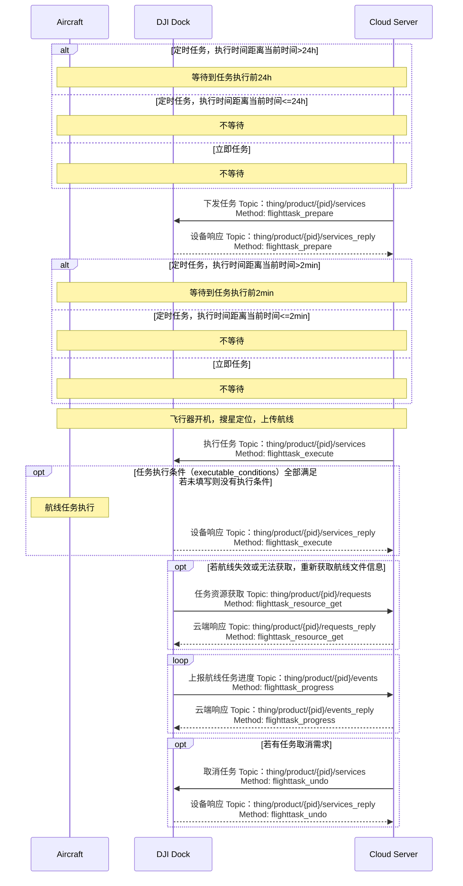
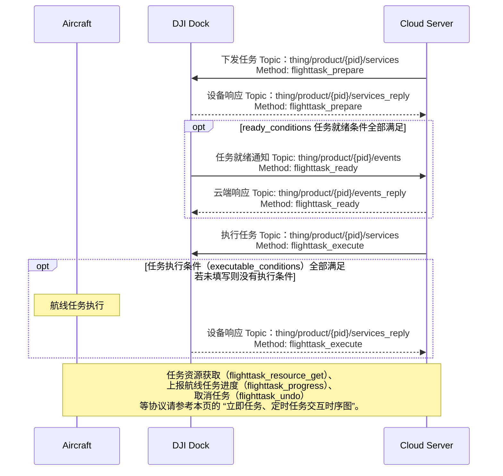

## 功能概述

航线管理是无人机自主作业的重要功能，可以实现行业领域的批量化、智能化作业。上云 API 提供了相关的接口，实现了航线任务在云端的共享查看、下发执行、取消以及进度上报等功能。用户需要遵照[航线文件格式规范（WPML）](https://developer.dji.com/doc/cloud-api-tutorial/cn/specification/dji-wpml/overview.html)编写航线文件，定义航线任务。一个航线任务中可以定义多条航线。

通过航线管理接口，用户可以通过航线文件信息指定航线任务、任务开始执行的时间、任务类型与航线类型，完成任务的下发。每个航线任务给定一个"flight_id"，以id作为指引，可以确定需要执行与取消的航线任务，任务取消支持批量取消。航线任务进度可上报，云端可以获取到设备当前的进度信息（如当前执行到的步骤、进度百分比等）。

航线任务接口、接口中的字段、字段的解释请根据本页中的“接口详细实现”的指引查询。如果在使用航线管理功能的过程中出现了错误，请通过返回的错误码在[错误码](https://developer.dji.com/doc/cloud-api-tutorial/cn/server-api-reference/error-code.html)章节中查询对应的错误描述。

## 交互时序图

航线任务划分立即任务、定时任务与条件任务。条件任务的交互与其他任务存在不同，我们分开介绍。

### 立即任务、定时任务

### 条件任务

## 接口详细实现

> **注意：**
>
> * 我们已经将`创建航线任务`接口废弃，请使用`下发任务`与`执行任务`接口。
> * 若`task_type`任务类型指定为“立即执行”时，设备端限制了30s的时间误差，若设备收到指令的时间与`execute_time`相差超过30s，将报错且该任务无法正常执行。
> * 若设备正在执行航线任务的过程中，再次收到航线任务执行的指令，再次收到的航线任务不会执行并且设备将报错。
> * 若用户的云服务无法访问外网，需实现 配置更新 功能，下发可被云服务访问的 NTP 服务的 URL，以实现时钟同步，否则航线任务将无法正常执行。

[航线管理](https://developer.dji.com/doc/cloud-api-tutorial/cn/server-api-reference/mqtt/thing-model/gateway/dock/wayline.html)

* 设备返航退出状态通知 
  * 进入“返航退出状态”，指当机场处于返航模式时，由于本 API 中的 reason 字段展示的某个原因，退出了返航过程。相似的，退出“返航退出状态”，指机场停止了退出返航这一过程。
  * 用于通知设备的返航退出状态。在设备完成任务返航时如果意外触发避障，设备进入”返航退出状态“，为防止出现电量耗尽类似的原因导致设备损毁，需要通知用户这一状态并下发返航指令，使设备退出”返航退出状态“。

* **上报飞行任务进度** 
  航线任务执行进度可上报，上报信息包括进度信息以及拓展信息。
* 任务就绪通知 
  下发条件任务后，设备会定频检查`下发任务` API 中的 `ready_conditions` 是否全部满足，若全部满足则会有任务就绪通知（flighttask_ready）事件通知。
* 创建航线任务（已废弃）

* 下发任务  
  航线管理当前增加了"预发布"的概念，飞行任务的提前下发给机场与飞行器预留了一些准备时间。在`下发任务`接口调用后，还需要调用`执行任务`接口执行。`task_type` 对任务类型进行了指定，`execute_time` 在定时任务和立即任务时为必填项，在条件任务时不必关注。 `ready_conditions` 为条件任务必填项，如果全部满足将有`flighttask_ready`事件通知。`executable_conditions`没有对任务类型的限定，所有任务类型执行都可以有执行条件限制，若未填写即表明没有执行条件。

* 执行任务 
* 取消任务  
  支持批量取消任务，仅能取消任务的下发，无法取消正在执行中的任务。
* 任务资源获取  
  任务资源获取将返回`flight_id`对应航线任务的航线文件信息。

