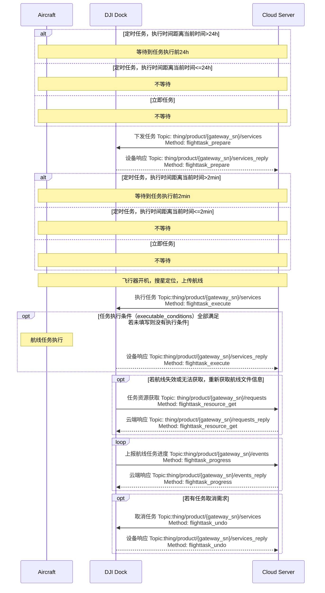
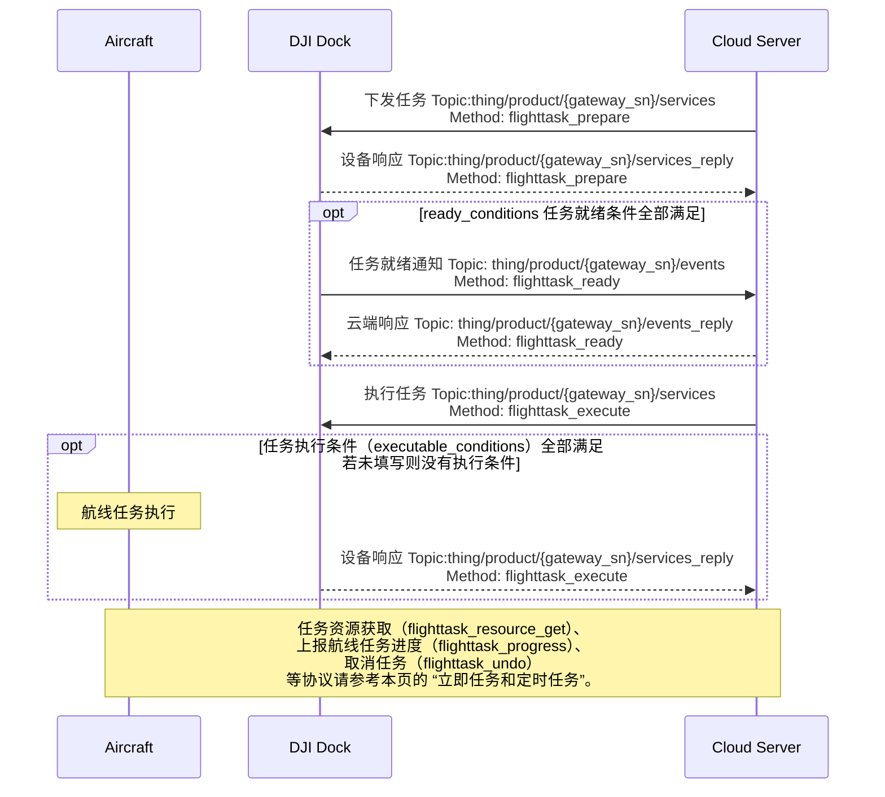

## 功能概述

航线管理是无人机自主作业的重要功能，可以实现行业领域的批量化、智能化作业。上云 API 提供了相关的接口，实现了航线任务在云端的共享查看、下发执行、取消以及进度上报等功能。用户需要遵照[航线文件格式规范（WPML）](https://developer.dji.com/doc/cloud-api-tutorial/cn/api-reference/dji-wpml/overview.html)编写航线文件，定义航线任务。一个航线任务中可以定义多条航线。

航线任务接口、接口中的字段、字段的解释请根据本页中的“接口详细实现”的指引查询。如果在使用航线管理功能的过程中出现了错误，请通过返回的错误码在[错误码](https://developer.dji.com/doc/cloud-api-tutorial/cn/error-code.html)章节中查询对应的错误描述。

### 模拟器调试

航线管理新增支持模拟航线飞行。开启模拟器后，飞行器将正常执行航线任务的准备工作，如机场开舱、启动等动作。飞行器将以模拟器字段中给定的经纬度作为起始点数据，执行航线任务，但飞行器不会实际起飞。飞行器执行任务期间的飞行器数据，将正常通过osd上报。

> **注意：** 模拟器执行航线任务不会使能 RTK。经过模拟器调试后，若要继续开展室外航线任务，需要确保获取到稳定的 RTK 信号以正常执行航线任务。

### 断点续飞

航线任务在一次飞行中因为某些原因（譬如航线过长、恶劣天气、人为中断等）无法完成时，断点续飞可以让航线任务从记录的断点继续执行，不需要从头再次飞行。

* 断点返航阶段： 
只要航线任务没有完成，断点信息就将被记录。在航线执行过程中，航线任务执行进度（Method: flighttask_progress）将被持续上报，断点信息将通过该 API 上报。在飞行器返回机场后，断点信息由机场上传到云端保存。详细的断点信息请查看`上报航线任务进度 API`中的[断点相关字段](https://developer.dji.com/doc/cloud-api-tutorial/cn/api-reference/dock-to-cloud/mqtt/dock/dock1/wayline.html)。

* 断点续飞阶段： 
云端下发断点续飞任务，`任务下发 API `中将包含断点相关字段。机场将断点信息提供给飞行器，飞行器飞向断点，继续执行航线任务。**断点续飞时， 航线任务的 KMZ 文件中`安全起飞高度字段（wpml:takeOffSecurityHeight）`将被 “MQTT 下发任务 API（Method: flighttask_prepare）`返航高度字段（rth_altitude）`替换，用于规避起飞点到断点之间碰撞障碍物的可能性。**

## 交互时序图

航线任务划分立即任务、定时任务与条件任务。条件任务的交互与其他任务存在不同，我们分开介绍。

### 立即任务和定时任务

### 条件任务

## 接口详细实现

> **注意：**
>
> * 我们已经将`创建航线任务`接口废弃，请使用`下发任务`与`执行任务`接口。
> * 若`task_type`任务类型指定为“立即执行”时，设备端限制了30s的时间误差，若设备收到指令的时间与`execute_time`相差超过30s，将报错且该任务无法正常执行。
> * 若设备正在执行航线任务的过程中，再次收到航线任务执行的指令，再次收到的航线任务不会执行并且设备将报错。
> * 若用户的云服务无法访问外网，需实现 配置更新 功能，下发可被云服务访问的 NTP 服务的 URL，以实现时钟同步，否则航线任务将无法正常执行。

[航线管理（MQTT）](https://developer.dji.com/doc/cloud-api-tutorial/cn/api-reference/dock-to-cloud/mqtt/dock/dock1/wayline.html)

* 设备返航退出状态通知 
  * 进入“返航退出状态”，指当飞行器处于返航模式时，由于本 API 中的 reason 字段展示的某个原因，退出了返航过程。相似的，退出“返航退出状态”，指飞行器停止了退出返航这一过程。
  * 用于通知设备的返航退出状态。在设备完成任务返航时如果意外触发避障，设备将进入”返航退出状态“。为防止出现电量耗尽类似的原因导致设备损毁，需要通知用户这一状态并下发返航指令，使设备退出”返航退出状态“。

* 上报飞行任务进度 
  航线任务执行进度可上报，上报信息包括进度信息以及拓展信息。
* 任务就绪通知 
  下发条件任务后，设备会定频检查`下发任务` API 中的 `ready_conditions` 是否全部满足，若全部满足则会有任务就绪通知（flighttask_ready）事件通知。
* 创建航线任务（已废弃）

* 下发任务  
  航线管理当前增加了"预发布"的概念，飞行任务的提前下发给机场与飞行器预留了一些准备时间。在`下发任务`接口调用后，还需要调用`执行任务`接口执行。`task_type` 对任务类型进行了指定，`execute_time` 在定时任务和立即任务时为必填项，在条件任务时不必关注。 `ready_conditions` 为条件任务必填项，如果全部满足将有`flighttask_ready`事件通知。`executable_conditions`没有对任务类型的限定，所有任务类型执行都可以有执行条件限制，若未填写即表明没有执行条件。

* 执行任务 
* 取消任务  
  支持批量取消任务，仅能取消任务的下发，无法取消正在执行中的任务。
* 任务资源获取  
  任务资源获取将返回`flight_id`对应航线任务的航线文件信息。

