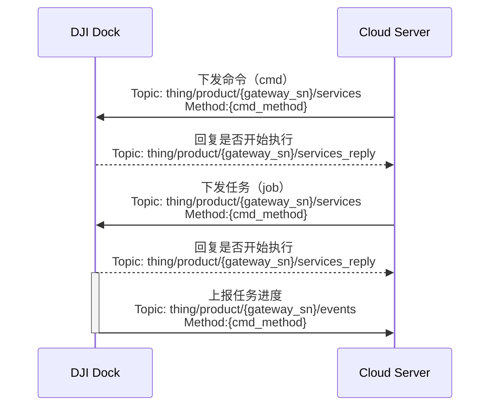

## 功能概述 

远程调试为在调试的作业流中实现无人值守，即让作业人员无需到现场，在云端就可以下发命令到设备端，进行设备的远程排障。远程调试命令可分为命令（cmd）和任务（job）。命令（cmd）一般指命令下发后，设备能即刻回复的行为，而任务（job）为任务下发后，设备需要持续动作的行为。

### 远程调试指令
下发的指令经由云端跟设备之间传输的`下发控制命令`协议中“method”字段指定，详细的协议内容请根据本节中的`接口详细实现`在`云端API章节`中查看。

|命令（cmd）|任务（job）|
|:---:|:---:|
|调试模式开启/关闭 补光灯开启/关闭 4G图传功能开启/关闭 一键返航|机场重启 飞行器开机/关机 一键排障（一键起飞自检） 飞行器数据格式化 机场数据格式化 打开/关闭舱盖 推杆展开/闭合 充电打开/关闭 |

### 任务（job）执行流程
任务（job）下发后，设备将会返回执行状态。该状态定义在传输协议的“status”字段中。
状态列举如下：
* 已下发
* 执行中
* 执行成功
* 暂停
* 拒绝
* 失败
* 取消或终止
* 超时

执行流程如下：

## 交互时序图

## 接口详细实现

[远程调试](https://developer.dji.com/doc/cloud-api-tutorial/cn/api-reference/dock-to-cloud/mqtt/dock/dock1/cmd.html)
* 命令进度
* 下发命令
* 下发任务
* ......

