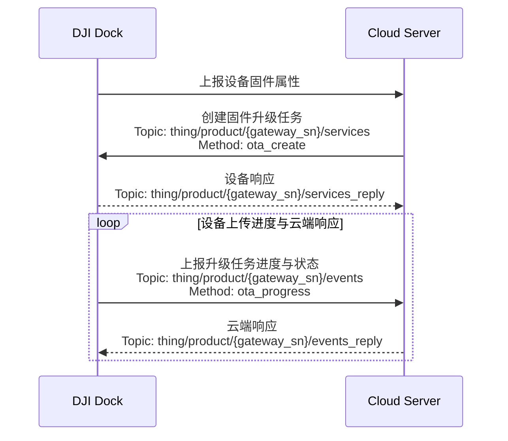

## 功能概述 

为实现对设备固件版本的维护，上云API 支持用户通过云端对机场与飞行器进行固件升级。用户可以实施单次升级以及批量升级、升级提示、升级进度的展示等。

为实现固件升级功能，需要用户预先在开发者官网下载所需的固件安装包，譬如[M30系列的固件版本包](https://www.dji.com/cn/downloads/products/matrice-30)。用户需要将固件安装包、固件版本等信息自行维护在云端服务器中。设备上报的固件属性信息与云端的固件包信息进行比对，判断是否需要固件升级。在云端下达`固件升级`命令时，需要在协议中补充升级设备的序列号、固件版本号、固件升级文件的存储地址、以及固件升级的类型等。设备可以通过`固件升级进度`命令中的`percent`与`step_key`参数得到固件升级的进度和当前步骤。具体请按照`接口详细实现`中的内容在云端 API 进行详细查阅。

> **注意：**
> * 通过固件升级物模型属性上传，`firmware_version`和最新固件的版本号对比，可以用来判断是否需要普通升级。`compatible_status`可以用来判断是否需要一致性升级。
> * 升级的优先级顺序：普通升级 **高于** 一致性升级。普通升级能够覆盖一致性升级。因为如果设备的版本与固件最新版本一致为1.x，但是电池模块的固件偏低，所以设备端将会报需要一致性升级的物模型。但是如果固件最新版本为2.x，与设备的版本不一致，顺带会把版本偏低的电池模块升级，最终固件不一致的问题会被解决。

## 交互时序图

## 接口详细实现

* [机场物模型属性](https://developer.dji.com/doc/cloud-api-tutorial/cn/api-reference/dock-to-cloud/mqtt/dock/dock1/properties.html)

* [固件升级](https://developer.dji.com/doc/cloud-api-tutorial/cn/api-reference/dock-to-cloud/mqtt/dock/dock1/firmware.html)
  * 固件属性上报 
    固件升级功能会上报`设备固件版本号 - firmware_version`与`固件一致性 - compatible_status`两个属性字段。`firmware_version`和最新固件的版本号对比，可以用来判断是否需要普通升级。`compatible_status`可以用来判断是否需要一致性升级。

  * 固件升级任务下发 
    云端下发的固件升级 API 需要完成设备的序列号、固件升级包相关信息以及固件升级类型的填充。

  * 固件升级进度 
    设备上报固件升级进度到云端，通过字段的获取，可以在云端可视化界面呈现升级进度、升级进度百分比以及当前升级的步骤等关键信息。通过`固件升级进度`API的`ota_progress`字段来判断是否正在升级中。

