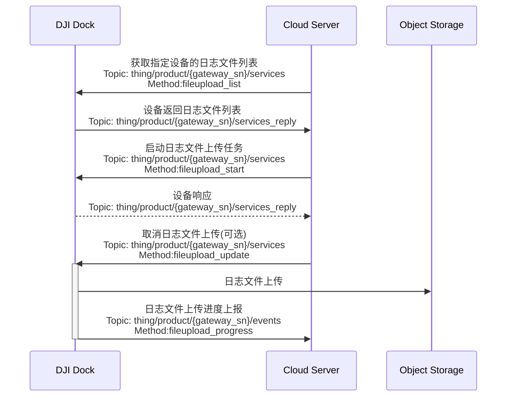

## 功能概述 
为了解决机场日志与飞行器日志对人工手动获取的依赖，上云API 开放了远程日志功能，希望能够减少机场问题的人力投入、缩短问题反馈的流程、并且提升问题处理的效率。远程日志支持机场日志与飞行器日志的上传。云端服务器向设备请求获取日志文件列表，设备响应并上传列表。

以我们的远端日志Demo为例，借助云端服务器可视化界面，用户可以通过`日志文件列表获取`接口得到日志列表并呈现在web页面，勾选需要上传的日志文件，云端服务器借助`日志文件上传`接口启动日志上传任务，设备上传对应的日志文件。在上传过程中也可以通过`取消上传`接口取消上传任务。日志文件存储采用的是 OSS 对象存储方式，存储在云端的日志文件也可以下载到本地，用户可以借助获取的日志文件，自行通过邮件联系DJI售后以解决问题。

> **注意：** 当前日志上传启动后，暂时不支持上传任务暂停、暂停后恢复、上传任务拒绝。

## 交互时序图

## 接口详细说明

[远程日志](https://developer.dji.com/doc/cloud-api-tutorial/cn/api-reference/dock-to-cloud/mqtt/dock/dock1/log.html)
* 获取设备可上传的文件列表
* 发起日志文件上传
* 上传状态更新
* 文件上传进度通知

