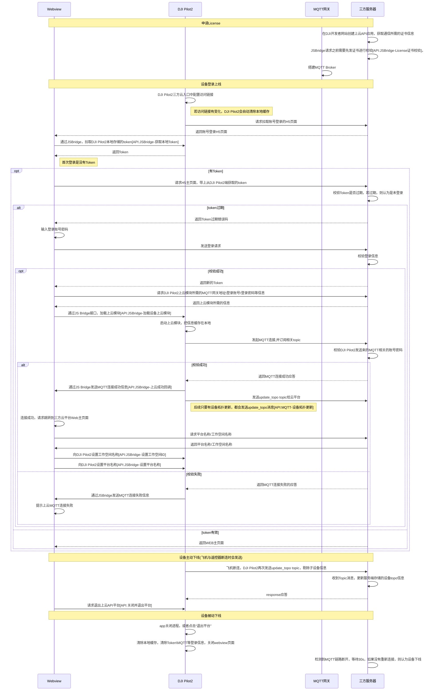

## 上下线详细流程

## 创建上云API应用

在使用上云API的接口之前，需要在大疆开发者网站中先注册成为开发者，注册完成后，即可创建“上云API”应用，以及可以拿到API交互所需的APP ID、APP 秘钥、APP License，后续在JSBridge交互中，需要先校验这三个参数。如果DJI Pilot2校验License错误，则无法完成DJI Pilot2上云的后续动作。

              

              

## 配置三方云链接
如下图所示，在DJI Pilot2的主页面云服务栏目中有“开放平台”入口，然后在开放平台页面中输入访问的URL链接即可发起连接。

由于首次请求H5页面，并没有Token信息，所以需要服务器端开发一个H5登录页面，DJI Pilot2在每次配置完访问链接，都先去拉取该页面，然后后续的获取Token动作均由该H5页面完成。

注意：

1. 访问链接是一个http/https链接，如果需要使用https，则需要进行SSL认证，具体的SSL认证详见《**设备安全认证**》章节。

              

              

## 接口详细实现

### License证书校验

开发者在注册上云API应用之后，需要进行License认证校验，接口详见《**JSBridge接口参考**》- `window.djiBridge.platformVerifyLicense(String appId,String appKey,String license)`

### 获取本地Token

DJI Pilot2会本地存储访问的Token信息，开发者可以通过Webview JSBridge接口去读取DJI Pilot2存储的Token信息，这样方便开发者进行校验Token是否过期。接口详见《**JSBridge接口参考**》- `window.djiBridge.apiGetToken()`

注意：使用该接口之前，需要先加载“API模块”，接口详见《**JSBridge接口参考**》- `window.djiBridge.platformVerifyLicense(String appId,String appKey,String license)`

### 加载设备上云模块

加载上云模块的过程会发起MQTT登录请求，所以需要服务端预先进行MQTT网关的登录账号密码配置并取消MQTT匿名方式登录。*当然，如果对于安全性没有要求的，也可以直接采用默认的匿名登录，从而减少MQTT账号密码的配置。具体的网关登录账号密码配置可以参考《MQTT网关安装测试》章节*

DJI Pilot2默认是没有加载上云模块的，需要Webview向服务端申请拿到上云模块所需的MQTT相关登录信息，并通过JSBridge使能Pilot2的上云模块和赋值参数。Pilot2的上云模块组件加载之后，会根据获取的MQTT参数，向服务端发起MQTT连接请求，待请求登录成功后，DJI Pilot2也会通过JSBridge把状态通过回调告知Webview。接口详见《**JSBridge接口参考**》- `window.djiBridge.platformVerifyLicense(String appId,String appKey,String license)`

### 设置工作空间ID/平台信息

Webview在获取到上云模块推送过来的上线成功的信息之后，可以向后台请求需要往DJI Pilot2中设置的平台和工作空间名称及描述，这三个字段内容由开发者自己根据实际业务需求进行定义。H5页面获取到平台名称、工作空间名称、工作空间描述之后，可以通过JS Bridge接口往DJI Pilot2设置这些信息，DJI Pilot2则会把这工作空间名称和工作空间描述字段显示在DJI Pilot2上云入口处，平台名称显示上webview顶部标签栏中。

涉及的API接口：

1. 设置工作空间ID：接口详见《**JSBridge接口参考**》- `window.djiBridge.platformSetWorkspaceId(String uuid)`
2. 设置平台信息：接口详见《**JSBridge接口参考**》- `window.djiBridge.platformSetInformation(String platformName, String workspaceName, String desc)`

              

              

### 设备拓扑更新

Pilot2在加载上云模块之后，立即向服务端发起MQTT连接请求。请求连接成功后，紧接着会再发送topo_updagte的Topic给服务端。接口详见：《**设备拓扑更新**》章节
