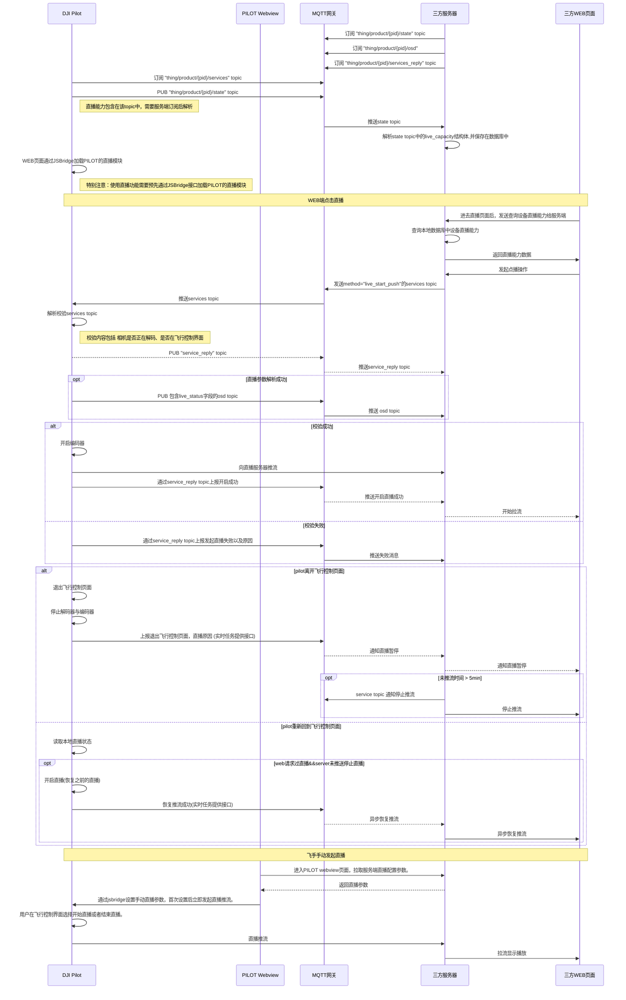

## 功能概述

直播功能主要是把无人机相机负载和大疆机场的监控视频码流发给三方云平台进行播放，用户可以方便的在远程web页面点击直播。

## 支持的直播类型

| 直播类型  | 描述                                                         | 备注                           |
| --------- | ------------------------------------------------------------ | ------------------------------ |
| Agora声网 | 声网Agora成立于2013年，是实时音视频云行业开创者和全球领先的专业PaaS服务商。 开发者只需简单调用Agora API，30分钟即可在应用内构建多种实时音视频互动场景。 大疆司空2也是基于声网的“极速直播”功能进行码流推送，整体直播延迟比较低，效果好。 对于三方云私有化部署，Agora也提供了混合云部署模式，码流和数据都在客户的私有服务器中，然后通过网闸打通一个链路到Agora的运维公有云，这个链路通道主要是用来对私有化部署的服务进行升级和运维。 |  -                              |
| RTMP      | RTMP是Real Time Messaging Protocol（实时消息传输[协议](https://baike.baidu.com/item/协议/13020269)）的首字母缩写。该协议基于TCP，是一个协议族，包括RTMP基本协议及RTMPT/RTMPS/RTMPE等多种变种。RTMP是一种设计用来进行实时数据通信的网络协议，主要用来在Flash/AIR平台和支持RTMP协议的流媒体/交互服务器之间进行音视频和数据通信。  | 注意：DJI行业设备暂不支持RTMPS |
| RTSP      | RTSP（Real Time Streaming Protocol）是 TCP/IP 协议体系中的一个应用层协议，该协议定义了一对多应用程序如何有效地通过 IP  网络传送多媒体数据。RTSP在体系结构上位于RTP和RTCP之上，它使用TCP或UDP完成数据传输。HTTP与RTSP相比，HTTP传送HTML，而RTSP传送的是多媒体数据。 |    -                            |
| GB28181   | GB/T 28181-2016为《**公共安全视频监控联网系统信息传输、交换、控制技术要求**》，主要是中国大陆地区对于安防视频设备接入平台的一种传输控制规范，对于已有28181下联网关的服务器，可以直接通过该协议把DJI行业设备的码流推到服务器中。 |                   -             |

## 直播总体框架

 
              

 如上图所示，无人机飞行平台并不直接连接三方云平台，中间是通过DJI Pilot2或大疆机场进行转流转发，遥控器和机场与无人机之间的通信还是用DJI私有图传ocusync链路。

 三方云平台需要预先部署MQTT网关以及流媒体服务器，DJI推流协议支持RTMP/GB28181/Agora  4种模式，其中MQTT网关主要用来做消息通信，配置信息设置和读取。

## 直播相关变量解释
| 变量名                     | 说明                                                         |
| -------------------------- | ------------------------------------------------------------ |
| `device_list`              | 表明飞机(或者其他设备)的列表，里面包含了camera层次。         |
| `available_video_number`   | 可用于直播的视频流总数。表明飞机或设备所拥有的所有可用于直播视频流的总数。 |
| `coexist_video_number_max` | 可同时进行直播的最大视频流总数。                             |
| `camera_list`              | 表明某一个飞机（或者设备）所拥有的相机列表，里面包含了video层次 |
| `camera_type`              | 相机的型号                                                   |
| `camera_id`                | 相机的id号，由相机的型号名称+相机在飞机上的位置编号组成。在1个飞机（或者设备）里面，该编号唯一。 |
| `video_list`               | 表明某一个相机所拥有的视频流列表。                           |
| `video_type`               | 表明视频流的类型，如H20T相机中，有wide、zoom、ir、normal几种类型。关于normal和其他的区别：normal表示该通道的视频流内容会发生变化，如APP在前端进行一次画面内容调整的时候，H20T的直播画面内容就会发生变化。wide、zoom、ir表明该通道就是固定传输指定内容的画面的。除非通道进行切换，不然该通道内的画面内容是固定的，不会被APP调整所影响。 |
| `video_index`              | 表明视频流的索引和编号，由视频流的类型和视频流在相机内部的编号所示。如wide-0，在一个相机域内，该编号唯一 |
| `video_id`                 | 用来唯一指定有一个视频流的ID编号，组成规则`#{uav_sn}/#{camera_id}/#{video_index}`例：`AFAFEFA34D/H20T-0/normal-1` |
| `video_quality`            | 直播的质量，特制直播参数的几个档位，如自动、流畅、高清、超清。其中，每一个档位，对应一些已经预设的bps、fps、resolution，保证可以视频流的体验。如果选择自动，则自动在流畅、高清、超清几个档位中调节。 |
| `video_param_mode`         | 用来查询或者设置直播相关信息时所用到的mode提示，目前仅有“default”和“advanced”两种，其中default表明设置video_quality，advanced表明详细设置视频的bps、fps、resolution（dpi）。 |
| `live_trendline`           | 表示直播带宽的使用状态(或者说直播性能趋势)。每一个直播通道有一个有normal、overuse、underuse三种状态。例如overuse，表示带宽使用过载了，从而判断网络发生拥塞。如果是underuse状态，表示带宽未能充分利用。取值范围还是[0,10]：0-4表示overuse，其中，数值越小，表示overuse程度越大；5表示normal状态；6~10表示underuse，其中，数值越大，表示有更多比例的带宽未能充分利用。 |
| `live_time`                | 直播时间，表明设备端开始直播之后所运行的时间                 |
| `url_type`                 | 视频流直播参数所需要指定的url type。该type类型可以表明是GB28181、RTMP、RTSP、声网等直播协议； |
| `url`                      | 在URL type确定的基础上，url用来指明该url_type基础下的具体的url参数。对于不同url_type，url的组成规则有些差别。对于声网的URL参数，为防止token中包含特殊字符，云端采用URLEncoder编码之后下发，推流端需经过URLDecoder解析之后再使用。 |
| `fps`                      | 视频流帧率                                                   |
| `bps`                      | 视频流码率                                                   |
| `dpi`                      | 视频流分辨率，或者叫resolution。                             |

## PILOT端直播流程

## API接口说明

### 加载直播模块

在使用直播功能之前，需要预先在webview中通过JSBridge加载DJI Pilot2的直播模块，开发者可以考虑在上下线登录阶段直接添加加载直播模块的接口。

API: 详见《**JSBridge接口参考**》-`window.djiBridge.platformLoadComponent(String name, String param)`

### 直播能力更新

live_capacity这个字段是放在网关设备的物模型中的，同时推送的属性为当设备端有状态变化时才推送。

API: 详见《**云端API参考-MQTT-直播-直播能力更新**》章节。

### 开始直播

服务端通过mqtt给设备端发送`method=live_start_push`的指令，这条指令采用的是物模型的service方式交互。

API: 详见《**云端API参考-MQTT-直播-开始直播**》章节。

### 停止直播

API: 详见《**云端API参考-MQTT-直播-停止直播**》章节。

### 设置直播清晰度

API: 详见《**云端API参考-MQTT-直播-设置直播清晰度**》章节。

### Pilot端手动直播

对于无需后台直播观看，但是需要在用户使用时，开启直播，把码流传回服务端进行存档分析的场景，可以通过该接口组合，让用户在PILOT中手动触发直播功能，详细步骤如下：

1. PILOT端webview登录三方云平台后，需要向服务端请求一个流媒体服务器直播地址参数，各个三方云平台配置不同，也可以直接写死在前端代码中。

2. 把直播推流参数通过jsbridge接口，发给DJI Pilot2进行设置。

   API:详见《**JSBridge接口参考**》-`window.djiBridge.liveshareSetConfig(type: Int, params: String)` 

3. DJI Pilot2收到直播配置后，立即发起直播推流，用户可以进入飞行界面查看直播信息，停止直播，重新开始直播等操作。

*注意：采用手动直播方式，推流的画面一直是DJI Pilot2主画面码流，当飞手切换相机画面时，推流的画面也会跟着变化。*

## 直播相关常见问题

- **通过服务端发送`live_start_push`命令，PILOT会出现未响应崩溃的现象？**

1. 请按照说明文档详细检查相关的参数配置。
2. 请确认在使用直播功能之前，是否已经通过JS Bridge接口把PILOT中的直播模块加载起来。

- **前端页面使用JSwebrtc库来播放28181的推流时，会出现返回码为400的错误？** 

1. 因为GB28181从SIP信令握手到推流需要几秒钟的时间，如果请求直播后马上点播，会出现没有码流的错误。
2. 所以需要开发者在发送开始直播之后，等待28181媒体服务器点播以及PILOT OSD推动状态改变成正在推流直播后，再点击打开播放器进行直播。 

- **前端页面使用Agora声网WEB-SDK时，会出现以下报错：**

1. 这是因为声网Agora Web SDK做了访问安全限制，仅支持HTTPS协议或者http://localhost(http://127.0.0.1)进行访问，如果用Http访问则会报错。*(调试时各种异常的话，首先考虑是不是这个问题)*

- **发送声网直播请求参数时，UrlType为0时，会出现以下错误：**

1. 主要是因为UrlType是int型，同时标明'required'，所以服务端会去校验int是否有没有填，而int型没有填写时，本身就是0,所以会报错，只需要把'required'去掉就行。
2. 另一种做法是吧UrlType改成指针*UrlType，这样它校验的空值就变成null，然后通过指针取值就行。 