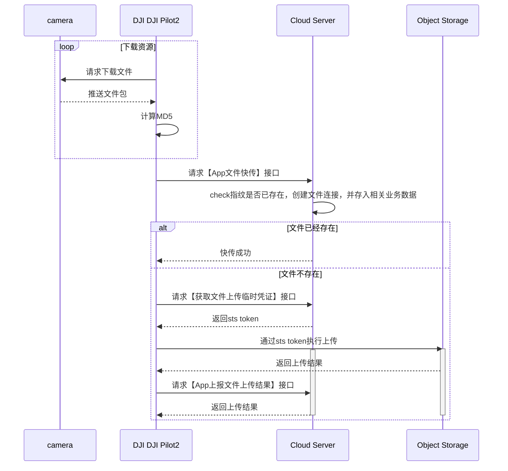

## 功能概述

媒体库功能集主要是DJI Pilot2或大疆机场把飞机上的图片/视频下载到遥控器/机场本地存储，然后再通过网络上传到三方服务器的过程。媒体上传包含自动上传和手动上传功能，对于机场只有自动上传功能。

媒体对象存储支持OSS / S3 两种。demo示例是基于阿里云OSS测试，如遇到其他存储桶没法上传，请与我们联系。

              

## 交互时序图

## API接口说明

### 加载Media媒体库模块

在使用媒体库模块功能之前，需要预先在H5页面中通过JSBridge设置好工作空间信息（workspaceId），配置好api模块，然后加载DJI Pilot2的media模块。开发者可以考虑在上下线登录阶段直接添加加载media模块的接口。

API: 详见《**JSBridge接口参考**》-`window.djiBridge.platformLoadComponent(String name, String param)`

### 文件快传

由于传输文件时可能会存在云端已有的图片，那么DJI Pilot2或机场在上传文件时，会启动文件快传接口，服务端需要检查该文件是否已经上传存在了，如果存在了，直接返回上传成功。

API: 详见《**云端API参考-HTTP-媒体管理-文件快传**》章节。

### 获取文件精简指纹

对于文件是否存在，需要做对应的指纹校验，但由于媒体文件大小不一，所以大疆提供了一套媒体文件精简指纹生成方案，服务端只需按照该方案计算媒体指纹信息，并返回给DJI Pilot2端。

API: 详见《**云端API参考-HTTP-媒体管理-获取已经存在的文件精简指纹**》章节。

### 获取上传临时凭证

每次媒体上传时，需要向服务端获取临时文件上传凭证，这样DJI Pilot2在上传时会带上该凭证给对象存储服务进行校验。

API: 详见《**云端API参考-HTTP-媒体管理-获取上传临时凭证**》章节。

### 媒体上传结果上报

媒体文件传输结束后，DJI Pilot会调用该接口向服务端告知对应的媒体文件上传结果。

API: 详见《**云端API参考-HTTP-媒体管理-媒体文件上传结果上报**》章节。
