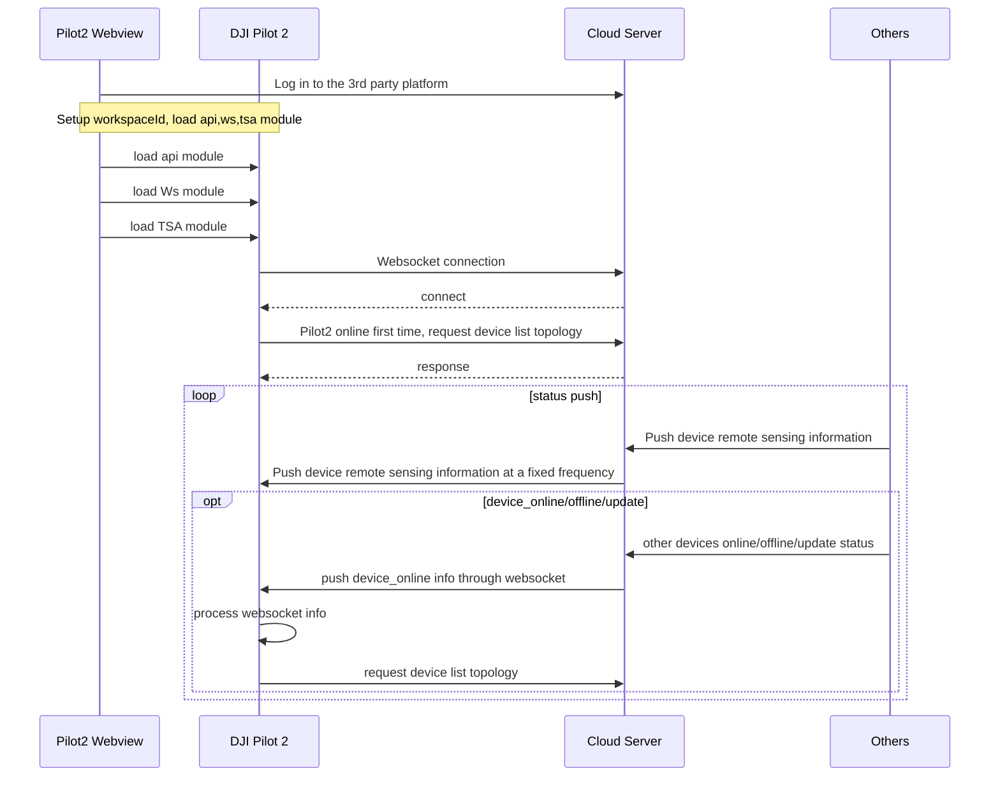

## Function Overview

TSA is a function that supports DJI Pilot 2 to display the aircraft/RC info on the map by using the device coordinate information which is sent by the Server end. Both web end and DJI Pilot 2 end will have all devices info under the same workspace. It can help the communication and info sharing between all devices/Pilot2/teammates.


For example, in the following figure,Pilot A,Pilot B, DOCK A, DOCK B, Human, and other devices have pushed their information to the server through API. Once the server end receives all information, it will summarize it and push it to different DJI Pilot 2 through WebSocket, thenPilot A andPilot B will have all info displayed in their APP.

 <center>        <br>     </center>

## Interaction Sequence Diagram




## Detailed API Realization

* [JSBridge](https://developer.dji.com/doc/cloud-api-tutorial/en/api-reference/pilot-to-cloud/jsbridge.html)
  
  * Load DJI Pilot 2 TSA Module `window.djiBridge.platformLoadComponent(String name, String param)` <br/>
    Before using the TSA function, developers need to set up the workspaceId, configure the Ws module and api module, and then load the DJI Pilot 2 map module. Also, developers can consider adding the loading interface of map module in log-in phase. 

* [Situation Awareness (HTTPS)](https://developer.dji.com/doc/cloud-api-tutorial/en/api-reference/pilot-to-cloud/https/situation-awareness/obtain-device-topology-list.html)

  * Obtain Device Topology List<br/>
    In the first connection, DJI Pilot 2 will send out an http request to obtain all devices list and topology list. On the server end, it needs to synchronize the device list to DJI Pilot 2. Also, if it receives an instruction of device online/offline/update from WebSocket, it needs the same interface to request the update of the device topology list.

  * Custom Icon<br/>
    The device can display custom icons by using icon_urls. If the field is defined, it will be displayed in preference to the content of the field. If not, it is displayed by default by device_model. 

```json
"icon_urls":{      
                "normal_icon_url":"resource://Pilot2/drawable/tsa_aircraft_others_normal",    // Normal status icon
                "selected_icon_url":"resource://Pilot2/drawable/tsa_aircraft_others_pressed",   // Selected status icon
            }
```

App has some built-in icons.

```json
url style:  resource://Pilot2/drawable/tsa_aircraft_others_normal
```

**Built-in Icon List**

| Icon                                                         | Icon_url                                        | Remark |
| ------------------------------------------------------------ | ----------------------------------------------- | ------ |
|  | resource://Pilot2/drawable/tsa_car_select       |        |
|  | resource://Pilot2/drawable/tsa_car_normal       |        |
|  | resource://Pilot2/drawable/tsa_person_select    |        |
|  | resource://Pilot2/drawable/tsa_person_normal    |        |
|  | resource://Pilot2/drawable/tsa_equipment_select |        |
|  | resource://Pilot2/drawable/tsa_equipment_normal |        |

Support online icon. Online Icons are downloaded and cached inside the App and displayed on the map at a fixed size (28dp).

```
url style: http://r56978dr7.hn-bkt.clouddn.com/tsa_equipment_normal.png
```

The icon in DJI Pilot 2 Map: 

<center>        <br>     </center>

* [Situation Awareness (WebSocket)](https://developer.dji.com/doc/cloud-api-tutorial/en/api-reference/pilot-to-cloud/websocket/situation-awareness/message-push.html) and [Remote Controller Properties](https://developer.dji.com/doc/cloud-api-tutorial/en/api-reference/pilot-to-cloud/mqtt/rc-plus/properties.html)

  * Device Remote Sensing information Push<br/>
    The Server end will push all devices' remote sensing information under the same workspace to DJI Pilot 2 and DJI Pilot 2 will update the status and position of the device based on the received data.

  * Device Online/Offline/Update Topology Status Push<br/>
    When the Server end has received a request for any device online/offline/topology update, it will broadcast a device online/offline/topology update push notification to DJI Pilot 2. DJI Pilot 2 will trigger *"obtain device topology list"*
	