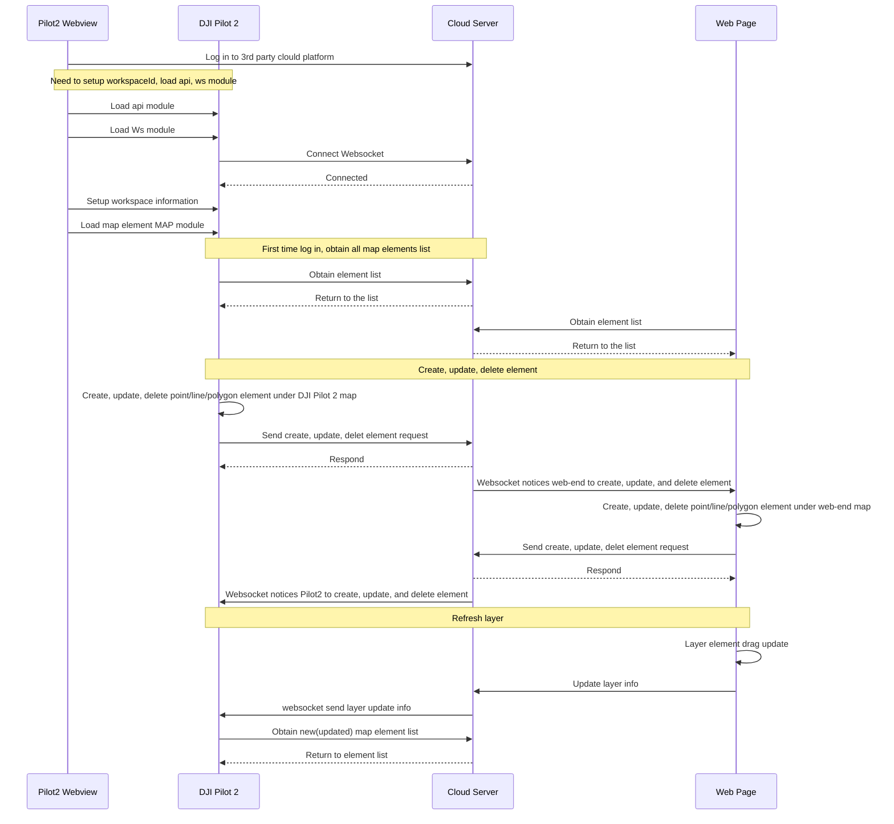

## Function Overview

The Map Elements is a function that can synchronize points, lines, and polygons from the DJI Pilot 2 map to the cloud server. To achieve a real-time tactical layout, it gives the commander/host the ability to share the layers with DJI Pilot 2 through the web browser. On the other side, DJI Pilot 2 can also share the signs to the web end to help the commander/host have more information. In addition, the platform also can distribute the layers from one DJI Pilot 2 to another different DJI Pilot 2 during the mission.

**Notes:**

1. Please set up the workspace. The DJI Pilot 2 only starts synchronizing the workspace's elements once the setup is complete.
2. *Different remote controllers will synchronize the map elements automatically without the transference from the Server end.*
3. If an aircraft connect with two remote controller A and B and only remote B has connected with Server, the new point/sign/mark from the remote controller A would synchronize with remote controller B first. Then the remote controller B will upload the point to the server end.
4. *The latitude and longitude coordinates of map elements use the WGS84 coordinate system. If the Web terminal uses Baidu, AutoNavi, etc., coordinate conversion is required.*

*Legend: DJI Pilot 2 Map UI*

*Legend: Web map page*

## Interaction Sequence Diagram

## Detailed API Realization

* [JSBridge](https://developer.dji.com/doc/cloud-api-tutorial/en/api-reference/pilot-to-cloud/jsbridge.html)
  
  * Load DJI Pilot 2 Map Element Module `window.djiBridge.platformLoadComponent(String name, String param)` 
    Before using the map element function, developers need to set up the workspaceId, configure the Ws module and api module, and then load the DJI Pilot 2 map module. Also, developers can consider adding the loading interface of map module in log-in phase.

* [Map Element (HTTPS)](https://developer.dji.com/doc/cloud-api-tutorial/en/api-reference/pilot-to-cloud/https/map-elements/create.html)

  * Obtain Map Element List 
    In the first connection, DJI Pilot 2 will send out an *http* request to obtain the map element list. On the server end, it needs to synchronize the map element list to DJI Pilot 2. Also, if it receives a layer refresh instruction from WebSocket, it needs the same interface to request the map element list.

    > **Note:** The list has to have the APP sharing layer, otherwise the successor element cannot be synchronized to the server.

  * New Map Element Request 
    When user draws a point, line or polygon on the Pilot2/Web side, it will send out a new map element request to the server end. Then the server end will respond after receiving the request.

  * Map Element Update Request 
    When user draws a point, line or polygon on the Pilot2/Web side, it will send out a map element update request to the server end. Then the server end will respond after receiving the request.

  * Delete Map Element Request 
    When user deletes a point, line or polygon on the Pilot2/Web side, it will send out a delete map element request to the server end. Then the server end will respond after receiving the request.

* [Map Element (WebSocket)](https://developer.dji.com/doc/cloud-api-tutorial/en/api-reference/pilot-to-cloud/websocket/map-elements/message-push.html)

  * Refresh Map Element List Push 
    When several elements have changed on the server end, such as drag an element on web end, the user end can be notified through WebSocket. The downward parameter has the layer group_id. The user end can call "*Obtain Map Element List*" to refresh the element list through *http* after receiving the ID.

  * New/Update/Delete Map Element Push 
    After receiving the new/update/delete map element request from Pilot2/Web end, the server end will update the stored element and will notify all terminal in the same workspace.