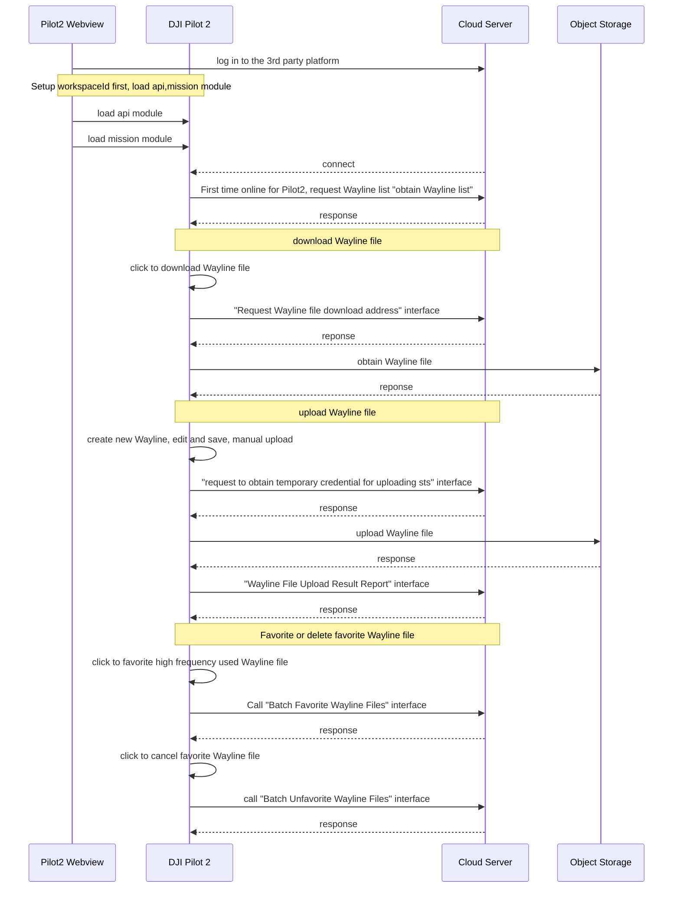

## Function Overview

Wayline management provides an ability that the flight path can be downloaded or uploaded in the same workspace. After logging in to the server through Pilot2, the user can obtain the Wayline list and display it in the Wayline library. In Pilot2, the Waylines existing in the cloud can be previewed directly, but when the user wants to edit the Wayline, it needs to be downloaded in DJI Pilot 2 locally and it will not affect the original Wayline in cloud. The edited Wayline need a new name for sharing.

*Note: After editing Wayline locally, it has to give a new name for the Wayline. Otherwise, the transmission of the Wayline will fail.*

              

We provide [Waypoint File Format Standard](https://developer.dji.com/doc/cloud-api-tutorial/en/api-reference/dji-wpml/overview.html). If users write waypoint files based on our standard, the development threshold can be significantly lowered.

## Interaction Sequence Diagram

## Detailed API Realization

* [JSBridge](https://developer.dji.com/doc/cloud-api-tutorial/en/api-reference/pilot-to-cloud/jsbridge.html)

  * Load Mission Wayline Module `window.djiBridge.platformLoadComponent(String name, String param)` 
    Before using the Wayline library module, developer need to setup the workspace ID in H5 through JSBridge, configure API module and then load the DJI Pilot 2 mission module. Also, developers can consider adding the loading interface of mission module in log-in phase.

* [Wayline Management (HTTPS)](https://developer.dji.com/doc/cloud-api-tutorial/en/api-reference/pilot-to-cloud/https/waypoint-management/obtain-waypointfile-list.html)

  * Obtain Temporary Credential 
    For each waypoint file upload, you need to obtain temporary file upload credentials from the server, so that DJI Pilot 2 will bring the credentials to the object storage service for verification when uploading.

  * Obtain Wayline List 
    After loading the Mission Wayline library module, DJI Pilot 2 will pull the list of Wayline files from the server via HTTP and display them in the DJI Pilot 2 Wayline library.

  * Obtain Wayline File Download Address 
    When user clicks to download Wayline in the DJI Pilot 2 Wayline list, the DJI Pilot 2 will initiate a request to get the Wayline download address.

  * Obtain Duplicated Wayline Name 
    DJI Pilot 2 does not allow duplicate Wayline names to exist in locally edited and uploaded Wayline files, so when uploading a Wayline file, you need to call this interface first to check if there is a duplicate Wayline file name, and if there is a duplicate Wayline file name, a pop-up window will prompt the user to rename the Wayline file name.

  * Wayline File Upload Result Report 
    After the Wayline file is uploaded to the object storage service, DJI Pilot 2 will report the upload result to the server side, which will perform the corresponding business operations on the result.

  * Batch Favorite Wayline Files 
    When users need to pay special attention to waypoint files, they can click on Favorites. At the same time, the interface will be called to mark the Wayline files that need to be favored.

  * Batch Unfavorite Wayline Files 
    Same function as above, to unmark the Wayline files as favorites.

