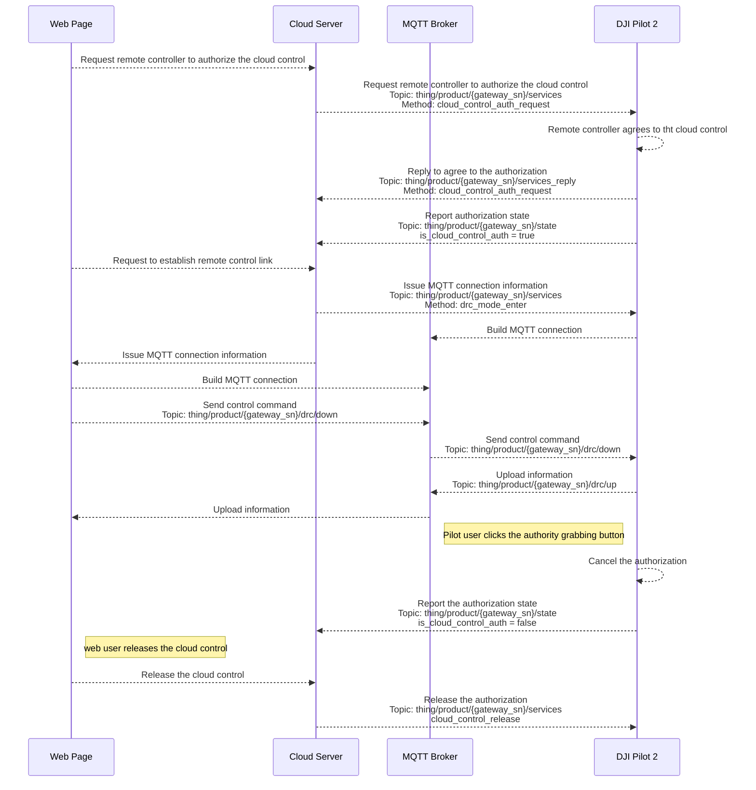

## Overview 

Pilot access to the cloud adds the remote control functionality. Users can control the aircraft gimbal and payloads via Pilot to achieve tasks such as looking at specific location, capturing, recording, measuring infrared temperature and so on. OSD and obstacle sensing information reporting is also supported. Currently only Mavic 3 Enterprise Series model is supported and there is no distinction between the flight control authority and payload control authority.

* Flight control commands (DRC commands)
  
  Drone Remote Control (DRC) uses MQTT protocol and add two new topics to represents upward link and downward link. [MQTT Topic Definition](https://developer.dji.com/doc/cloud-api-tutorial/en/api-reference/dock-to-cloud/mqtt/topic-definition.html) provides introduction and example of drc Topic structure. After the server and device successfully build MQTT link, an EMQX Broker will be distributed to the DRC communication link from server to device for faster transmission and response. To use DRC commands, the live flight controls control mode should be entered in advanced. DRC commands usually do not limited by flight control authority, but the `DRC-flight control Method: drone_control` must need the flight control authority.

Figure. DRC link

* Payload control commands: All the payload control commands require payload control authority. Current payload control commands control the camera and gimbal actions to realize the payload operations like photo taking, camera zooming in or zooming out, gimbal reset and so on. Therefore the target information can be obtained through these payload operations.

## Interaction Sequence Diagram

> **Note:** To avoid the drone damage, executing the control authority seizure is recommended before issue the live flight controls APIs.

## Detailed API Realization

> **Note:** Only when the "Media File Upload" is opened on Pilot, the media files generated by the payload control commands will be pushed by the media management function. For how to open the "Media File Upload" on Pilot, please refer to [the Media File Library chapter of *DJI FlightHub 2 User Manual*](https://fh.dji.com/user-manual/en/media-files.html).

[Live Flight Controls](https://developer.dji.com/doc/cloud-api-tutorial/en/api-reference/pilot-to-cloud/mqtt/rc-pro/drc.html)

* Flight control commands (DRC commands)
* Payload control commands

[Remote Control](https://developer.dji.com/doc/cloud-api-tutorial/en/api-reference/pilot-to-cloud/mqtt/rc-pro/remote-control.html)
