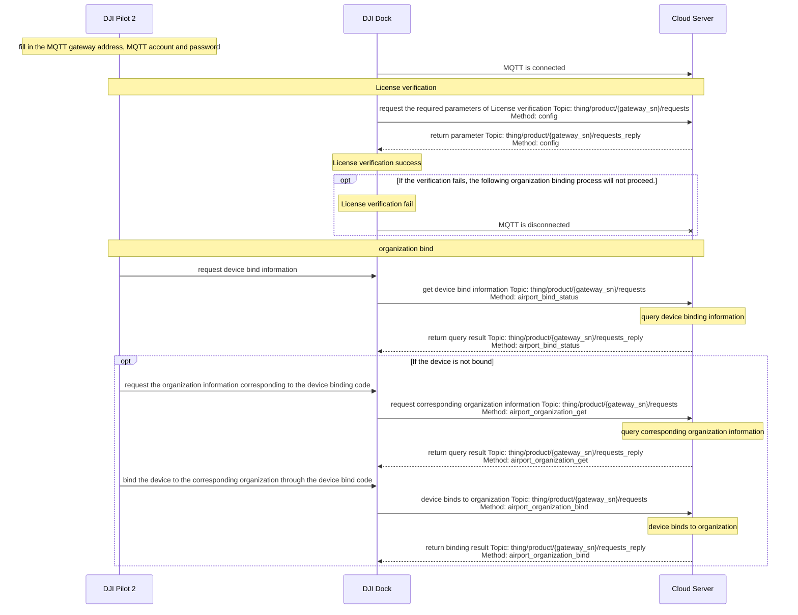

## Overview

The DJI Dock access to the Server requires the DJI Pilot 2 installed on the remote controller. As shown in the following figure, developers can complete the access process according to the instruction displayed in the Pilot. During the access process, developers need to check the device (such as checking the emergency stop buttons, and whether the internet is connected), connect the aircraft to the Dock, complete the configuration information (such as filling in the MQTT account and password to realize the MQTT connection), and so on. Through the Demo, operation instruction for the access process can be obtained. For the instruction video, please read the "Dock access to Cloud Server" in [Function Display Video](https://developer.dji.com/doc/cloud-api-tutorial/en/quick-start/function-display-video.html).

Dock access to the server needs License verification. The License comes from the App application of Cloud API type in the [Developer Website](https://developer.dji.com/user/apps/#all). The application result is shown in the following figure. After the successful application, the developer can be determined as a developer authorized by DJI.

> **Notes:**
>
> * When DJI Pilot 2 and the DJI Dock access third-party clouds, in scenarios with high-security requirements, the communication link needs to be encrypted to achieve secure data communication. By default, the SSL link believe that the device will authenticate the server, and the server will not authenticate the device. If the server enables the device authentication, the configuration of "clientAuth" needs to be performed on the server.
> * DJI Pilot 2 and DJI Dock support certificates issued by Godaddy. If developers need data security encryption, they can use the same certification authority certificate as DJI to achieve MQTT SSL authentication.

## Interaction Sequence Diagram

## Detailed API Realization

* [Pilot installation package](https://sdk-forum.dji.net/hc/en-us/articles/6177232395801-How-do-I-install-Pilot2-Where-can-I-get-the-installation-package-)

* [Configuration Update](https://developer.dji.com/doc/cloud-api-tutorial/en/api-reference/dock-to-cloud/mqtt/dock/dock1/config.html)
  * Get the configuration 

* [Organization Management](https://developer.dji.com/doc/cloud-api-tutorial/en/server-api-reference/mqtt/thing-model/gateway/dock/organization.html)
  * Obtain organization binding information
  * Search for the organization information that the device is bound to 
    If the device is successfully bound, the DJI Dock and aircraft will be bound to the corresponding organization of the device binding code. Developers can custom design how to verify and get the organization name for binding through the device binding code and organization ID filled in the Pilot. In the Demo, the device binding code is filled by default, it is only for reference.
  * Device binds to organization
