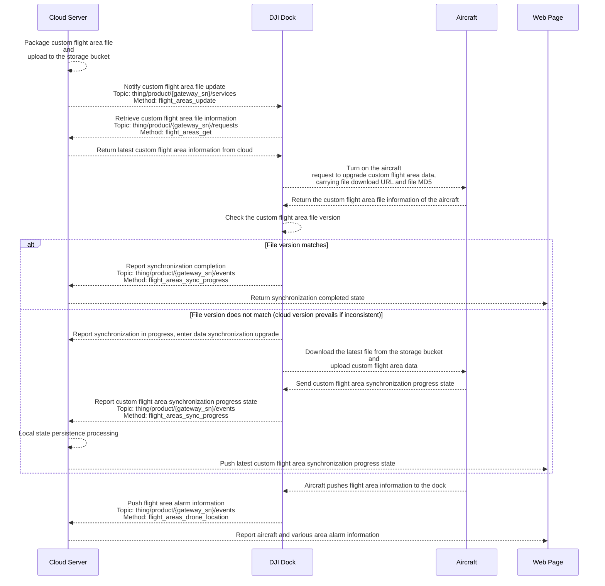

## Function Overview

The Cloud API adds custom flight area functionality. Users can designate sensitive locations as restricted zone and synchronize this information with DJI Docks within the project. When the aircraft performs tasks, it will automatically bypass the restricted zone, ensuring the safety and compliance of operations. This function define the aircraft flight area via the custom flight area file. **Click to download the [Custom Flight Area File Template](https://terra-1-g.djicdn.com/fee90c2e03e04e8da67ea6f56365fc76/SDK%20%E6%96%87%E6%A1%A3/CloudAPI/custom-flight-area-file-template-en.json)**.

This function allows users to plan custom flight areas on the map. There are two types of custom flight areas:

1. Custom Operation Area: Within this area, the aircraft can take off and perform tasks but cannot fly out of the area.
2. Custom GEO Zone: Outside this area, the aircraft can operate but cannot fly into the area.

## Interaction Sequence Diagram

## Detailed API Realization

[Custom Flight Area](https://developer.dji.com/doc/cloud-api-tutorial/en/api-reference/dock-to-cloud/mqtt/dock/dock2/custom-flight-area.html)