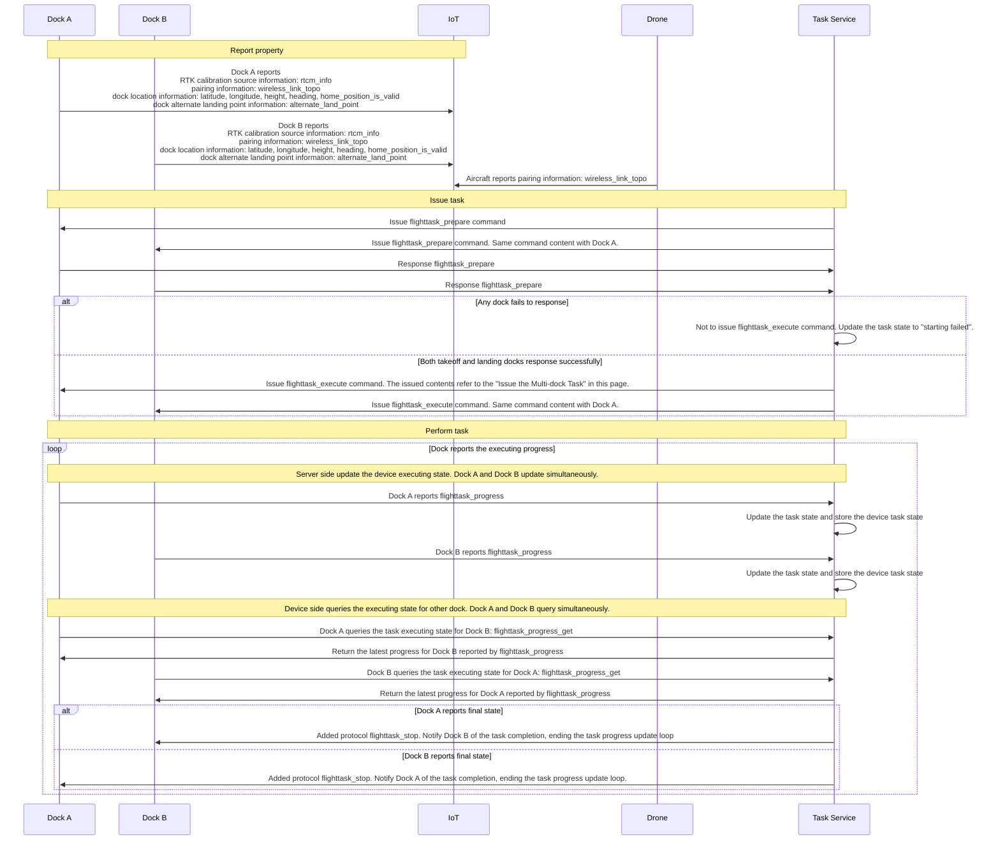

## Function Overview

DJI dock 2 supports multi-dock task. By configuring the docks for takeoff and landing via `flighttask_execute` command, the aircraft can takeoff from and land in different docks.

### Issue Multi-Dock Task

When following the sequence diagram to the task issuance period, if both the docks for takeoff and landing successfully respond, the `flighttask_execute` command is ready to be issued to start the multi-dock task. Key parameters of the `flighttask_execute` command are introduced as follows:

Adds the `multi_dock_task` field for configuring and verifying the parameters of the docks for takeoff and landing: 
* The `dock_infos` field can be used to select docks for performing a multi-dock task.
  * For the dock for takeoff, set the `dock_type` field to "takeoff". The `sn` field is the serial number of this dock. The `index` field is a unique identification during the task. The settings of the other fields refer to the latest reported dock properties.
  * For dock for landing, set the `dock_type` field to "landing". The settings of the other fields refer to the latest reported dock properties. Make sure the `index` field is not the same.
* The `wireless_link_topo` field can be used to pair the aircraft and two docks. Fill in the `secret_code` and `center_node` fields with corresponding fields from the aircraft property `wireless_link_topo`. Fill in the `leaf_nodes` field with the pairing information for the two docks. The `sdr_id` and `sn` fields should be filled in separately with the pairing information for the docks for takeoff and landing. The `control_source_index` field should be opposite for the dock for takeoff and the dock for landing. For example, if the `control_source_index` field for the dock for takeoff is reported as 1, the field for the dock for landing should be 2. When the field for the dock for landing is reported as 1 and for the dock for takeoff should be 2. 

**Note:**

* Docks that perform multi-dock tasks must use the same network RTK service source for calibration. [The `wayline_precision_type` is recommended to select "High-precision RTK mission"](https://developer.dji.com/doc/cloud-api-tutorial/cn/api-reference/dock-to-cloud/mqtt/dock/dock2/wayline.html) to avoid aircraft damage.

* Make sure that there is an aircraft in the dock for takeoff before performing a multi-dock task.

* If the aircraft triggers the Return-to-Home (RTH) logic or receives the RTH command issued by the user when performing a multi-dock task, it will automatically select the dock for landing based on the battery capacity and the location of the dock. The priority of the scheduled dock for landing is higher than the dock for takeoff. The aircraft will take the scheduled dock for landing as the RTH dock by default. When the aircraft is unable to land in the scheduled dock for landing, the dock for takeoff can be used as the RTH dock. When performing a flight route task, the new command `return_specific_home` can be used for designating the dock for landing.

* If the aircraft reaches the altitude zone when performing a multi-dock task, the default RTH logic and the relative altitude of the dock for takeoff will be used. Other Geo zone logic is consistent with a normal flight route task.

* When performing a multi-dock task, the *{gateway_sn}* of `live_start_push` topic should be in accordance with the `best_link_gateway` field reported by the aircraft. For the aircraft stream to remain continuous, when the aircraft property `best_link_gateway` changes, replace the *{gateway_sn}* of `live_start_push` topic with the latest gateway sn reported `best_link_gateway` property and re-issue the `live_start_push` command.

* For the downward command issuance of the aircraft when performing a multi-dock task, such as Pause, Resume and Return-to-Home commands, make sure they are consistent with the `gateway_sn` field of command topic and are in accordance with the `best_link_gateway` field reported by the aircraft.

* When a multi-dock task is being performed and the docks for takeoff and landing are set, the link for the controller B will be occupied. So the controller B will be disconnected.

## Interaction Sequence Diagram

IoT represents the IoT layer of the server for device access and device state maintenance. Task Service represents the upper business system of the server side for the device task management and task command issuance.

## Detailed API Realization

* [Dock Properties](https://developer.dji.com/doc/cloud-api-tutorial/cn/api-reference/dock-to-cloud/mqtt/dock/dock2/properties.html)
  * wireless_link_topo (Required)
  * rtcm_info (Required)
  * latitude (Required)
  * longitude (Required)
  * height (Required)
  * heading (Required)
  * home_position_is_valid (Required)
  * alternate_land_point (Required)
* [Aircraft Properties](https://developer.dji.com/doc/cloud-api-tutorial/cn/api-reference/dock-to-cloud/mqtt/aircraft/m3d-properties.html)
  * wireless_link_topo (Required)
  * best_link_gateway
* [Wayline Management](https://developer.dji.com/doc/cloud-api-tutorial/cn/api-reference/dock-to-cloud/mqtt/dock/dock2/wayline.html)
  * Service
    * flighttask_execute (Required)
    * flighttask_stop (Required)
    * return_specific_home
  * Requests
    * flighttask_progress_get (Required)
  * Events
    * return_home_info
