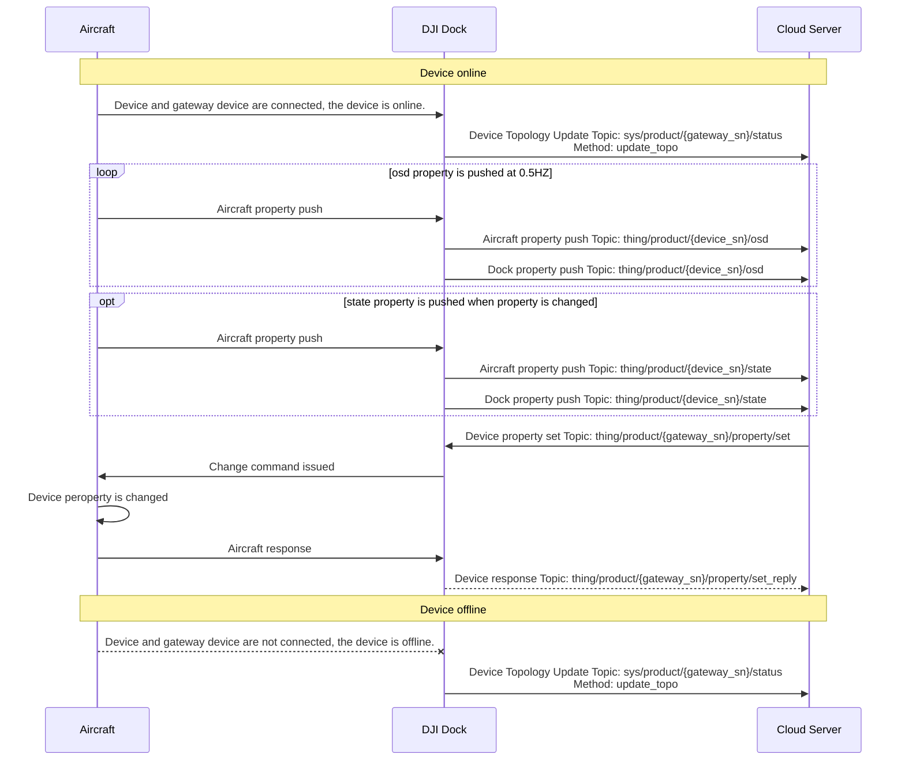

## Function Overview
Device management function supports reporting device topology information to the server, pushing device property to the server, and the server setting the device property. Users can check and modify the status of devices on server.

## Interaction Sequence Diagram

## Detailed API Realization
* [Aircraft device property](https://developer.dji.com/doc/cloud-api-tutorial/en/api-reference/dock-to-cloud/mqtt/aircraft/properties.html)
* [DJI Dock device property](https://developer.dji.com/doc/cloud-api-tutorial/en/api-reference/dock-to-cloud/mqtt/dock/dock1/properties.html)
* Device Management (MQTT):
  * Device Topology Update 
    When gateway device perceives the connection and disconnection with the sub-devices, gateway device will report the online and offline status of sub-devices. The `type` and `sub_type` value of API can be checkout from [Product Type](https://developer.dji.com/doc/cloud-api-tutorial/en/overview/product-support.html).

  * Device Property Push 
    Device property is divided into osd property and state property. The osd property is pushed at 0.5HZ frequency. The state property is pushed when property changes. Different properties is pushed by different topic. The properties is introduced at the chapter: [Aircraft Properties](https://developer.dji.com/doc/cloud-api-tutorial/en/api-reference/dock-to-cloud/mqtt/aircraft/properties.html), [Dock Properties](https://developer.dji.com/doc/cloud-api-tutorial/en/api-reference/dock-to-cloud/mqtt/dock/dock1/properties.html) and [Remote Controller Properties](https://developer.dji.com/doc/cloud-api-tutorial/en/server-api-reference/mqtt/thing-model/gateway/rc-plus/properties.html).

  * Device Property Set 
    * Not all the device properties can be set from the Server, we will implement that in the near future.
    * In the "Device Property" chapter, you can check the read and write status of device properties by the  symbol "accessMode". If the "accessMode" is "rw" means that the properites can be set.
    * Device property set only supports setting single peoperty field. For example, property `distance_limit_status` has two fields `state` and `distance-limit`. When setting the property `distance_limit_status`, the set command should be sent twice. 
