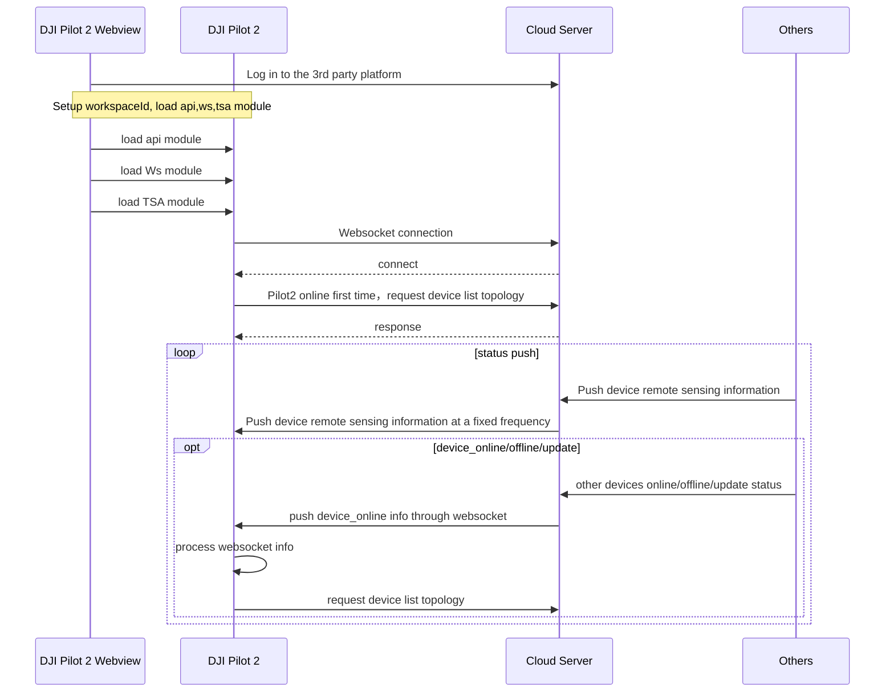

## Function Overview

TSA is a function that supports DJI Pilot 2 to display the aircraft/RC info on the map by using the device coordinate information which is sent by Server end. Both the web end and DJI Pilot 2 end will have all device info under the same workspace. It can help the communication and info sharing between all devices/Pilot2/teammates.

For example, in the following figure, Pilot A, Pilot B, Dock A, Dock B, Human, and other devices have pushed their information to the server through API. Once the server end receives all information, it will summarize it and push it to different DJI Pilot 2 through WebSocket, then Pilot A and Pilot B will have all info displayed in their APP.

 
              

## Interactive timing diagram

## API Detailed Realization

### Device Status Push
DJI Dock will push the device status at a fixed frequency to Cloud Server. Please refer to Server API > MQTT > Device Management > Push Device Status

### Device Online/Offline Push
If online or offline behavior exists, DJI Dock will update the device topology. Please refer to Server API > MQTT > Device Management > Update Device Topology