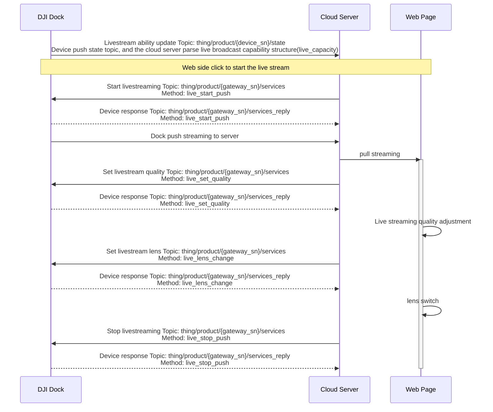

## Overview

The live stream function mainly sends the camera payload of the aircraft and the video stream of the DJI Dock to the tripartite cloud platform for broadcasting, and users can conveniently broadcast live on the remote web page. The live stream function supports the start, stop, resolution setting, and lens switching of the live stream.

### Supported Live Streaming Types

| Type    | Description                                                  |
| ------- | ------------------------------------------------------------ |
| Agora   | The DJI public cloud platform is also based on the "Interactive Live Streaming Standard" function of Agora. The overall live broadcast delay is relatively low and the effect is good.  For the third-party cloud privatization deployment, Agora also provides a hybrid cloud deployment model. The data is in the customer's private server, and then a link is opened through the air gap to Agora's public cloud. This link channel is mainly used to upgrade and operate and maintain the privatized deployed servers. | 
| RTMP    | Real-Time Messaging Protocol (RTMP) is a communication protocol for streaming audio, video and data over the Internet. This protocol is based on TCP and is a protocol family that includes the RTMP and RTMPT, RTMPS, RTMPE and many other variants. |
| GB28181 | GB/T 28181-2016 is a transmission control standard for the access of security video equipment to platforms in Mainland China. For some servers which already have 28181 downlink gateway, the data rate of DJI enterprise devices can be pushed to the server directly through this protocol. |
| WebRTC/WHIP   | WebRTC [(Web Real-Time Communication)](https://docs.dolby.io/streaming-apis/docs/webrtc-whip) is a technology that enables real-time communication of video and audio streams. It provides near real-time audio and video streams to ensure a smooth user experience. This technology is widely used in scenarios requiring high real-time communication, such as online meetings, online education, and telemedicine. WHIP [(WebRTC-HTTP Ingestion Protocol)](https://millicast.medium.com/whip-the-magic-bullet-for-webrtc-media-ingest-57c2b98fb285)is an HTTP-based protocol designed to provide a standardized signaling protocol between WebRTC producers and streaming media servers, facilitating the delivery of WebRTC streams into streaming media servers. It allows WebRTC-based content to be delivered to streaming media servers or CDNs.|

[Live Streaming (MQTT)](https://developer.dji.com/doc/cloud-api-tutorial/en/api-reference/dock-to-cloud/mqtt/dock/dock1/live.html)

### Live Streaming Framework of DJI Dock

As shown above, the aircraft flight platform is not directly connected to the tripartite cloud platform, it needs to be forwarded through the remote control or the DJI Dock. The communication between the remote control and the DJI Dock and the aircraft is still using DJI private AirLink.

The tripartite cloud platform requires pre-deployment of MQTT and streaming media server. DJI's streaming protocol supports Agora, RTMP, and GB28181. MQTT is mainly used for message communication, configuration information setting and reading.

## Interaction Sequence Diagram

## Detailed API Realization

[Live Streaming (MQTT)](https://developer.dji.com/doc/cloud-api-tutorial/en/api-reference/dock-to-cloud/mqtt/dock/dock1/live.html)
* Livestream ability update 
  live_capacity field is in the thing model of the gateway device, which is only pushed when the status of device is changed. The field contains the total amount of streams for live streaming, the total amount of streams for live streaming at the same time, live streaming ability list of devices.
* Start livestreaming 
  The server side sends `Start livestreaming` instruction, there are protocol type, live stream quality and other information contained in the instruction. 
* Stop livestreaming
* Set livestream quality 
  The quality can be set, and the enumeration value of quality can be checked in the "Server API" chapter.
* Set livestream lens 
  The live stream function can change the lens without influencing the live stream progress. The enumeration value of lenses can be checked in the "Server API" chapter.
