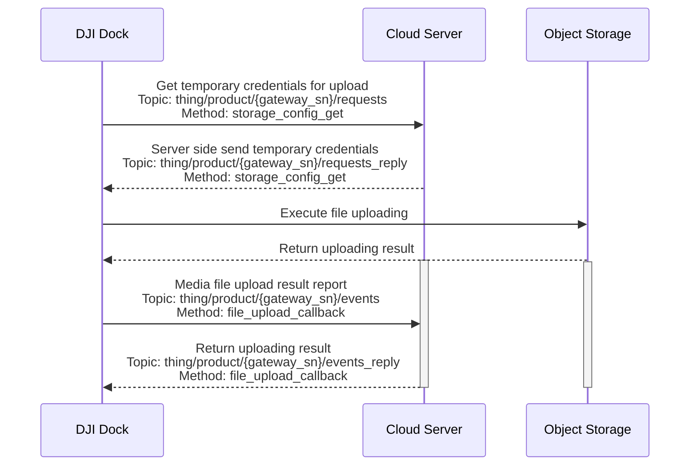

## Function Overview

The media library is the function that helps Pilot2/DOCK to upload the photos/videos, downloaded from aircraft to the remote controller/dock, to the 3rd party server. Media upload function includes auto upload or manual upload. For the DOCK, it has auto upload only.

Using the latest version of DJI Dock 2 firmware:

* The generated video files (infrared, visible light, and split-screen video files) will contain information about the aircraft's position and altitude, as well as the gimbal's attitude. This information is consistent with what was previously included in the SRT subtitle files generated alongside the video files in the older firmware.
* After completing a flight mission, the PPK files (.obs, .rtk, .mrk and .nav) and RTCM data (.dat) created on the aircraft's SD card will also be uploaded to the cloud storage bucket along with the media files.

              

## Interaction Sequence Diagram of DJI Dock

## Detailed API Realization

[Media Management (MQTT)](https://developer.dji.com/doc/cloud-api-tutorial/en/api-reference/dock-to-cloud/mqtt/dock/dock1/file.html)
* Obtain Temporary Credential 
  For each media upload, you need to obtain temporary file upload credentials from the server, so that DJI Dock will bring the credentials to the object storage service for verification when uploading.

* Reports File Upload Result 
  After the media file transfer is finished, DJI Dock will call this interface to inform the server of the corresponding media file upload result.
