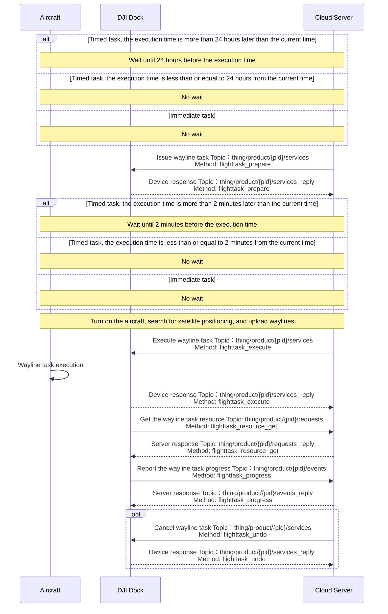
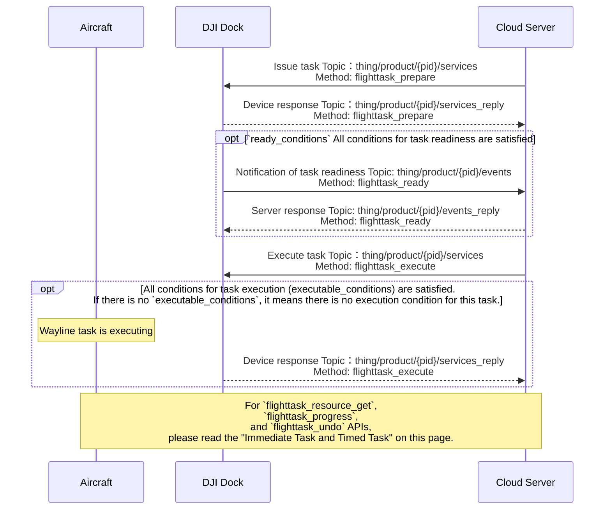

## Function Overview

Wayline management is an important function of drone autonomous operation, which can realize batch and intelligent operation in the industry. The cloud API provides relevant interfaces to implement the functions of issuing, executing, canceling, and progress reporting flight tasks.
Users need to follow the [Waypoint Markup Language (WPML)](https://developer.dji.com/doc/cloud-api-tutorial/en/feature-set/dji-wpml/overview.html) specification to write wayline file and define the wayline task. Multiple waylines can be defined in one wayline task.

For the wayline task interface, the fields in the interface, and the explanation of the fields, please refer to the guide of "Detailed API Realization" on this page. If there is an error in the process of using the route management function, please check [Error Code](https://developer.dji.com/doc/cloud-api-tutorial/en/server-api-reference/error-code.html) according to the returned error code.

## Interactive Timing Diagram

### Immediate Task and Timed Task

### Conditional Task

## Detailed API Realization

> **Notes:**
>
> * We have deprecated the `Create wayline task` interface, please use the `Issue wayline task` interface with the `Execute wayline task` interface.
> * If the task type of `task_type` is specified as "execute immediately", the device side limits the time error of 30s. If the difference between the time when the device receives the command and the `execute_time` exceeds 30s, an error will be reported and the task cannot be executed normally.
> * If the device is in the process of executing the route task and receives the command to execute the route task again, the route task received again will not be executed and the device will report an error.

[Wayline Management (MQTT)](https://developer.dji.com/doc/cloud-api-tutorial/en/server-api-reference/mqtt/thing-model/gateway/dock/wayline.html)

* Notification of device exiting the RTH
  * Entering the "RTH exiting state" means that the aircraft exits the RTH process due to one of the reasons in the `reason` field of Cloud API. Exiting the "RTH exiting state" means the aircraft stop the exiting process.
  * It is used to notify the "RTH exiting state". If obstacle avoidance is triggered when device completes the task and returns, device will enter the "RTH exiting state". To avoid device destruction, users should be notified to send RTH command to bring the device out of the "RTH exiting state".
* Report the wayline task progress 
  Route task execution progress can be reported, and the reported information includes progress information and expansion information.
* Notification of task readiness 
  After the conditional task is issued, the device will frequently check whether the `ready_conditions` is met. If all conditions are met, `flighttask_ready` will be sent.
* Create wayline task (Deprecated)
* Issue wayline task 
  The concept of "pre-release" is currently added to the route management. The "pre-release" of wayline task leaves more time for DJI Dock and aircraft to prepare. After the `Issue wayline task` interface is called, the `Execute wayline task` interface needs to be called to execute. In the `Issue wayline task` interface, assign a `flight_id` to the route task. With the `flight_id` field, you can execute, cancel, and obtain task resources for the specified route task.
* Execute wayline task
* Cancel wayline task 
  Cancel wayline tasks in a patch is supported. `Cancel wayline task` is used to cancel the assignment of wayline task. The executing wayline task can not be canceled by this interface.
* Get the wayline task resource 
  Get the wayline task resource will return the wayline file information of the `flight_id` corresponding wayline task.
