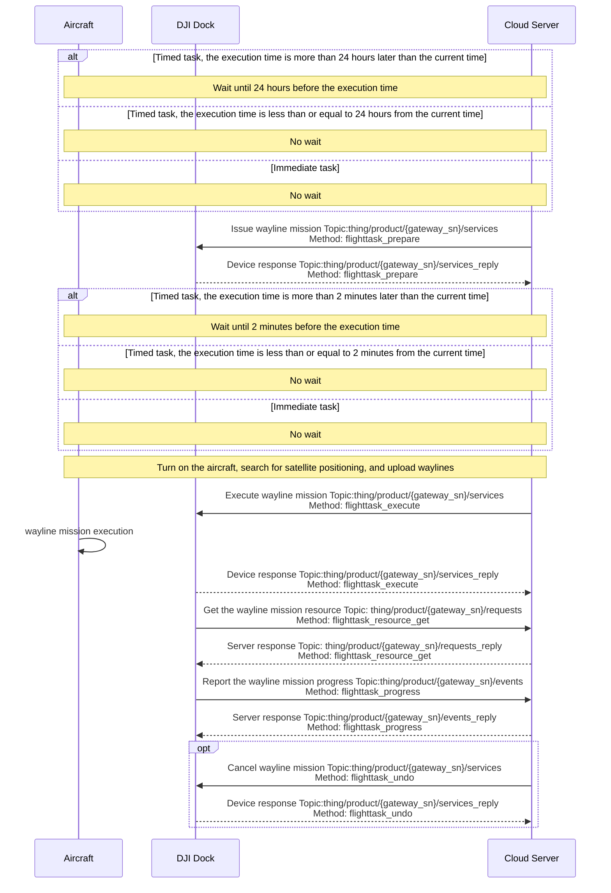
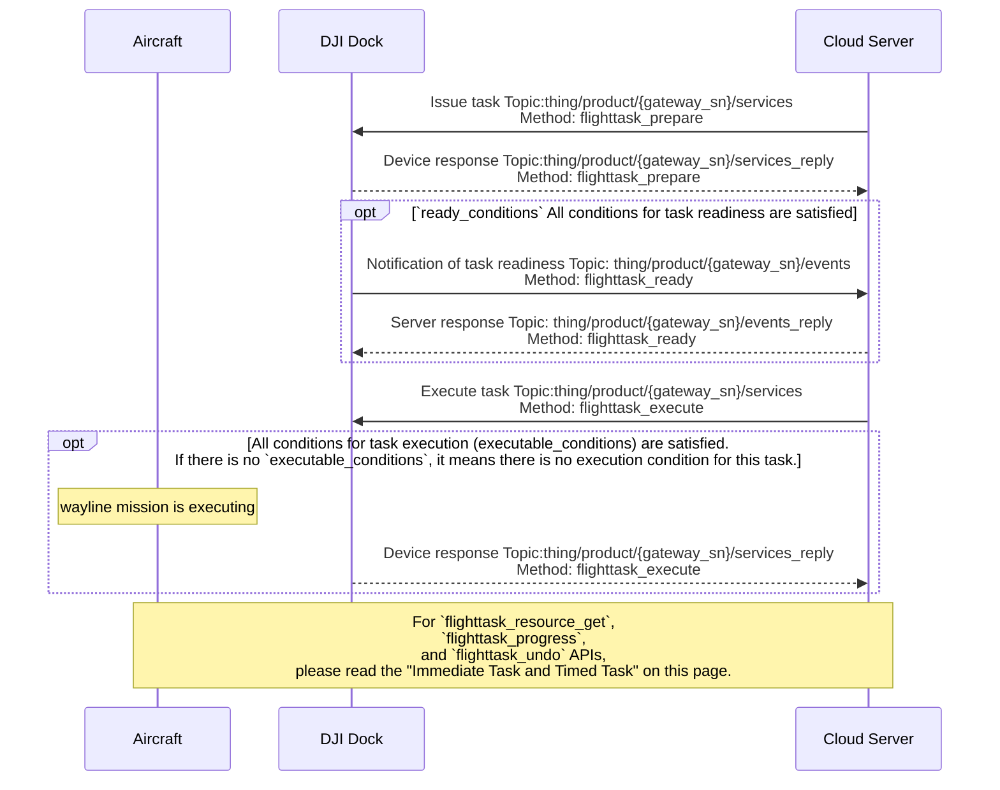

## Function Overview

Wayline management is an important function of drone automatic operation, which can realize batch and intelligent operation in the industry. The cloud API provides relevant interfaces to implement the functions of issuing, executing, canceling, and progress reporting flight tasks.
Users need to follow the [Waypoint Markup Language (WPML)](https://developer.dji.com/doc/cloud-api-tutorial/en/api-reference/dji-wpml/overview.html) specification to write wayline file and define the wayline mission. Multiple waylines can be defined in one wayline mission.

For the wayline mission interface, the fields in the interface, and the explanation of the fields, please refer to the guide of "Detailed API Realization" on this page. If there is an error in the process of using the route management function, please check [Error Code](https://developer.dji.com/doc/cloud-api-tutorial/en/error-code.html) according to the returned error code.

### Simulated Debugging

Wayline management newly supports simulated wayline flights. Once the simulator is enabled, the aircraft will go through the preparatory steps for the wayline mission, such as opening the dock cover and starting up. The aircraft will follow the specified longitude and latitude fields of `simulate_mission` API as the starting point data for the wayline execution, but aircraft will not actually take off. The aircraft's data during the execution of the task will be reported as usual via the `osd`. 

> **Note:** Simulated wayline mission will not enable RTK. After the simulated debugging, if outdoor wayline mission is going to execute, stable RTK signal should be obtained for normal and safe execution.

### Resume from Breakpoint

If wayline mission can not be completed in one flight because of some reasons, for example, too long wayline mission, bad weather and manual break, resuming from breakpoint allows the task to restart from the breakpoint but not from the start.

* Return from the breakpoint: 

Once the wayline mission is not finished, the breakpoint information will be recorded. During the wayline execution, the progress of wayline mission (Method: flighttask_progress) will be uploaded continuously, and the breakpoint information will be uploaded through this API. After the drone returns to the dock, the breakpoint information will be uploaded by dock to the cloud server for storage. Detailed breakpoint information can be seen from [related breakpoint fields](https://developer.dji.com/doc/cloud-api-tutorial/en/api-reference/dock-to-cloud/mqtt/dock/dock1/wayline.html) of `Method: flighttask_progress` API.

* Resume from the breakpoint: 

If cloud server sends the mission of resuming from breakpoint, the `issue wayline task API ` will contain related breakpoint fields. Dock provides the breakpoint information to the drone, then the drone flies to the breakpoint and continues the wayline mission. **When resumes from the break point, the `Safe takeoff altitude field (wpml:takeOffSecurityHeight)`in KMZ file of wayline mission will be replaced by the `height for RTH field (rth_altitude)` in issue wayline mission API of MQTT protocol to  avoid the possibility of crushing obstacle.**

## Interaction Sequence Diagram

### Immediate Task and Timed Task

### Conditional Task

## Detailed API Realization

> **Notes:**
>
> * We have deprecated the `Create wayline task` interface, please use the `Issue wayline task` interface with the `Execute wayline task` interface.
> * If the task type of `task_type` is specified as "execute immediately", the device side limits the time error of 30s. If the difference between the time when the device receives the command and the `execute_time` exceeds 30s, an error will be reported and the task cannot be executed normally.
> * If the device is in the process of executing the route task and receives the command to execute the route task again, the route task received again will not be executed and the device will report an error.

[Wayline Management (MQTT)](https://developer.dji.com/doc/cloud-api-tutorial/en/api-reference/dock-to-cloud/mqtt/dock/dock1/wayline.html)

* Notification of device exiting the RTH
  * Entering the "RTH exiting state" means that the aircraft exits the RTH process due to one of the reasons in the `reason` field of Cloud API. Exiting the "RTH exiting state" means the aircraft stop the exiting process.
  * It is used to notify the "RTH exiting state". If obstacle avoidance is triggered when device completes the task and returns, device will enter the "RTH exiting state". To avoid device destruction, users should be notified to send RTH command to bring the device out of the "RTH exiting state".
* Report the wayline mission progress 
  Route task execution progress can be reported, and the reported information includes progress information and expansion information.
* Notification of task readiness 
  After the conditional task is issued, the device will frequently check whether the `ready_conditions` is met. If all conditions are met, `flighttask_ready` will be sent.
* Create wayline mission (Deprecated)
* Issue wayline mission 
  The concept of "pre-release" is currently added to the route management. The "pre-release" of wayline mission leaves more time for DJI Dock and aircraft to prepare. After the `Issue wayline task` interface is called, the `Execute wayline task` interface needs to be called to execute. In the `Issue wayline task` interface, assign a `flight_id` to the route task. With the `flight_id` field, you can execute, cancel, and obtain task resources for the specified route task.
* Execute wayline mission
* Cancel wayline mission 
  Cancel wayline missions in a patch is supported. `Cancel wayline task` is used to cancel the assignment of wayline mission. The executing wayline mission can not be canceled by this interface.
* Get the wayline mission resource 
  Get the wayline mission resource will return the wayline file information of the `flight_id` corresponding wayline mission.
