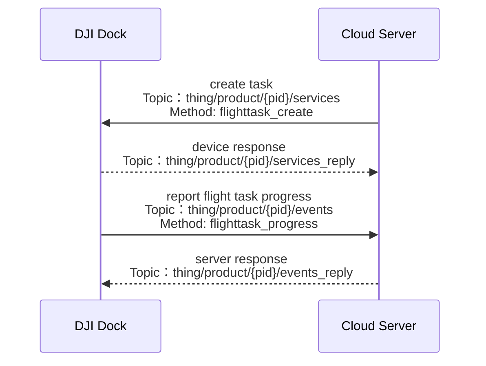

## Functional Overview

In order that the wayline files in the cloud can be combined and executed in one task, and the group of waylines can be viewed and shared in the cloud, the cloud API has opened up the function of wayline management. Users can plan the cloud WebView interface by themselves, and manually trigger wayline management related behaviors such as loop execution, single/multiple execution, execution model specification, and wayline execution visualization. Currently, the wayline management function can only be realized through the DJI Dock.

In the wayline management function, the interaction between the cloud and the device is relatively simple. The cloud creates a task and sends it to the device, specifies the wayline task used by the task and the device that executes the task, and the device responds and reports the task execution progress at a fixed frequency.

In the `create task` instruction sent by the cloud to the device, you need to provide the url storage address of the flight file and the file signature for verification. When the device `reports the task execution progress and status`, you can view the task execution status through the `status` field in the protocol, the ` current_step` field can view the current execution action against the enumeration value, and the `percent` field to obtain the current task execution progress percentage. For the detailed introduction of the fields in the protocol, please refer to the corresponding chapter of `Cloud API` according to `Interface Detailed Implementation` in this section. The above is a brief introduction to the relevant fields. If you need to obtain more detailed wayline management API information and related error codes, please refer to the API in the Cloud API chapter according to the interfaces listed in the `Interface Detailed Practice` in this section.

We provide [Waypoint File Format Standard](https://developer.dji.com/doc/cloud-api-tutorial/en/specification/dji-wpml/overview.html). If users write waypoint files based on our standard, the development threshold can be significantly lowered.

### Task execution status list

|Status
|Description
|
|---|---|
|sent|Distributed|
| in_progress |Executing|
|ok|executed successfully|
|paused|paused|
|rejected|Rejected|
|failed|failed|
|canceled|cancelled or terminated|
|timeout| Timeout|

## Interactive timing diagram

## Interface detailed implementation

* Create wayline mission

  API path: Cloud API > Thing Model > MQTT > Dock > wayline Management > Create wayline mission

* Report flight mission progress and status

  API path: Cloud API > Thing Model > MQTT > Dock > wayline Management > Report wayline mission progress

