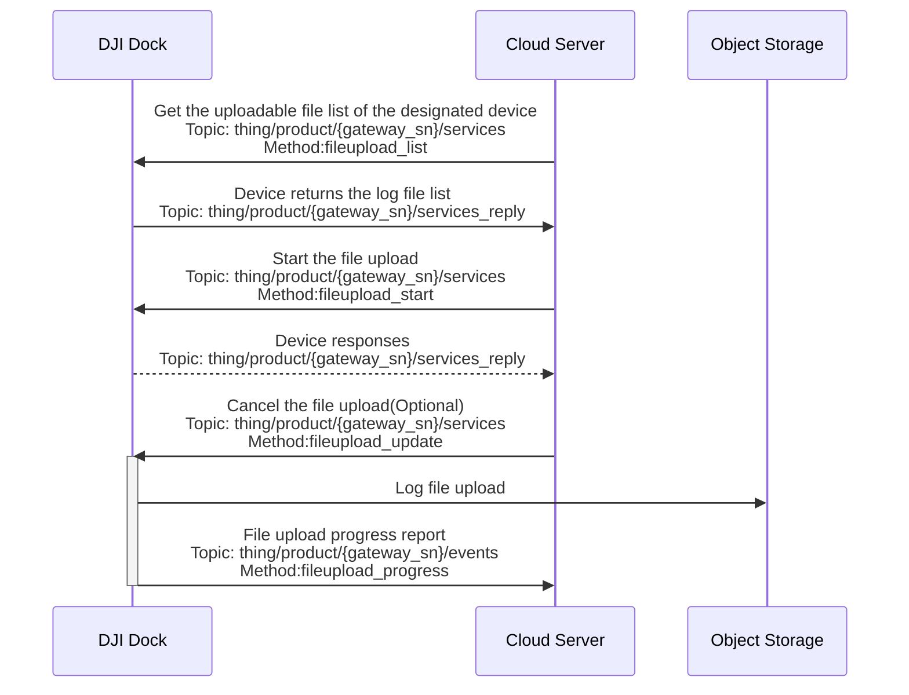

## Function Overview

Cloud API opens the remote log function, hoping to reduce the human input and improve the efficiency when resolving the Dock problems and aircraft problems. Remote log supports the upload of Dock log and aircraft log. The cloud server requests the log file list from the device, and the device responds and uploads the file list.

Take the Demo of remote log for example, Users can get the log file list through the `get the uploadable file list of the designated device` interface and display the list on the Web page. Users select the log files in need, the cloud server starts the upload mission through the `start the file upload` interface and the device uploads the corresponding files. The mission can be canceled by `file upload update` during the uploading process. The progress of file uploading can be displayed on Web page through the `file upload progress` interface. 

Object storage is used for the log file storage. If users have problems, you can download the log of that period from the cloud server and contact our after-sales colleagues through `dev@dji.com`.

> **Note:** Currently after the log starts to upload, pause the upload mission, restart after the pause, and reject the upload mission are not supported.

## Interaction Sequence Diagram

## Detailed API Realization

[Remote Log](https://developer.dji.com/doc/cloud-api-tutorial/en/api-reference/dock-to-cloud/mqtt/dock/dock1/log.html)
* Get the uploadable file list of the designated device
* Start the file upload
* Cancel the file upload
* File upload progress

