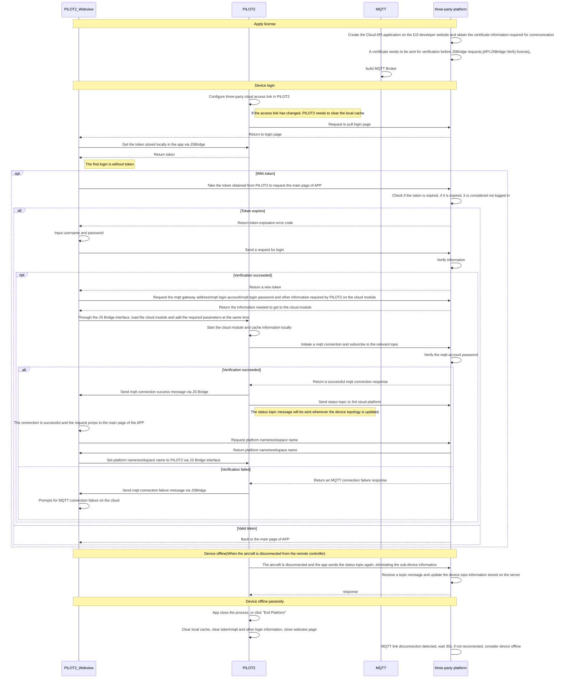

## Interactive Timing Diagram

## Create Cloud API License

Before you can use the Cloud API interface, you need to register as a developer on the DJI developer website. After registration, you will be able to create the "Cloud API" application and get the APP ID, APP key and APP License required for the API interaction. If the DJI Pilot2 does not check the license correctly, then it will not be able to complete the subsequent actions of the DJI Pilot2 on the cloud.

              

              

## Configure Thrid Cloud
As shown in the image below, there is an "Open Platforms" portal in the Cloud Service section of the DJI Pilot2's main page, and then you can initiate a connection by entering the URL link you are accessing in the Open Platforms page.

Since the first time the H5 page is requested, there is no token. so the server needs to develop an H5 login page, which the DJI Pilot2 will first pull after each configured access link, and then all subsequent actions to obtain the token will be completed by this H5 page.

*Note: The access link is an http/https link. If https is required, SSL certification is required, as detailed in the section **Data Security**.*

              

              

## Detailed Realization

### License Certificate Verification.

After registering the Cloud API application, developers will need to perform a license authentication verification. Refer to《**JSBridge API References**》- `window.djiBridge.platformVerifyLicense(String appId,String appKey,String license)`

### Requests the Token Which is Stored in PILOT2

The DJI Pilot2 stores the token locally and developers can get the token stored by the DJI Pilot2 through the Webview JSBridge interface, which allows developers to check whether the token has expired. Refer to《**JSBridge API References**》- `window.djiBridge.apiGetToken()`

*Note: Before you can use this interface, you need to load the "API Module".* 

Refer to《**JSBridge API References**》- `window.djiBridge.platformVerifyLicense(String appId,String appKey,String license)`

### Load Cloud Module

The process of loading the cloud module will initiate an MQTT login request, so the server needs to pre-configure the login password for the MQTT gateway and remove the MQTT anonymous login method. Of course, if there is no requirement for security, you can also directly use the default anonymous login, thus reducing the configuration of the MQTT account password.

PILOT2 does not load the cloud module by default, so the webview needs to apply to the server to get the MQTT related login information required for the cloud module and assign the value to PILOT2's cloud module through JS Bridge. After PILOT2's cloud module component is loaded, it will initiate an MQTT connection request to the server using MQTT parameters. After successful login, PILOT2 will also inform the webview of the status through JS Bridge. Refer to《**JSBridge API References**》- `window.djiBridge.platformVerifyLicense(String appId,String appKey,String license)`

### Set Workspace ID/Platform Information

The webview can request the platform and workspace name and description that need to be set in PILOT2 to the backend after getting the online success information pushed from the cloud module, and the content of these three fields will be defined by the developer according to the actual business requirements. After the H5 page gets the platform name, workspace name and workspace description, it can set these information to PILOT2 through JS Bridge interface, and PILOT2 will display the workspace name and workspace description fields in the cloud portal on PILOT2, and the platform name is displayed in the top tab bar of webview.

**API interface:**

1. Set workspace id: Refer to《**JSBridge API References**》- `window.djiBridge.platformSetWorkspaceId(String uuid)`
2. Set platform information: Refer to《**JSBridge API References**》- `window.djiBridge.platformSetInformation(String platformName, String workspaceName, String desc)`

              

              

### Topology Update for Devices

After loading the cloud module, PILOT2 immediately initiates an MQTT connection request to the server. After the connection request is successful, a status topic is sent to the server immediately afterwards. Refer to《**Update Device Topology**》.
