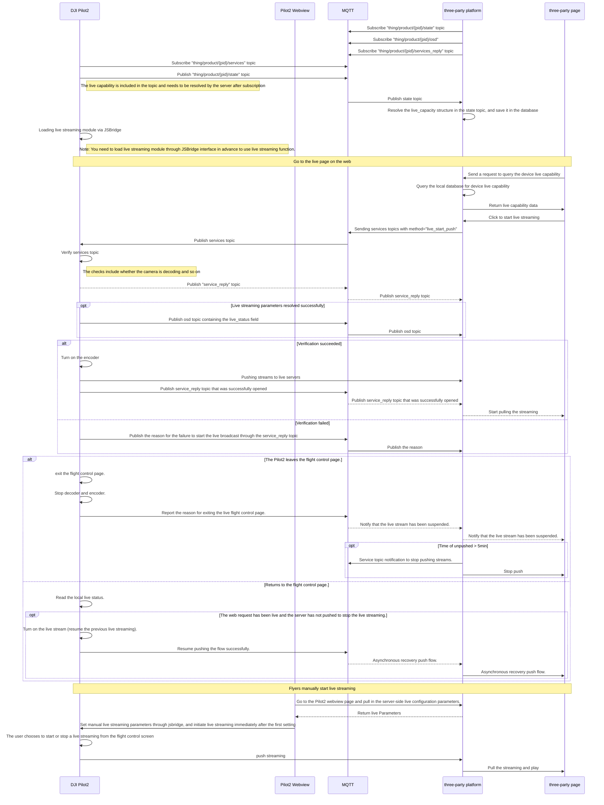

## Overview

The live streaming mainly sends the camera payload of the aircraft and the surveillance video stream of the airport to the tripartite cloud platform for broadcasting, and users can conveniently broadcast live on the remote web page.

## Supported Live Streaming Types

| Type    | Description                                                  | Remark                                                       |
| ------- | ------------------------------------------------------------ | ------------------------------------------------------------ |
| Agora   | The DJI public cloud platform is also based on the "Interactive Live Streaming Standard" function of Agora. The overall live broadcast delay is relatively low and the effect is good.  For the third party cloud privatization deployment, Agora also provides a hybrid cloud deployment model. The data is in the customer's private server, and then a link is opened through the air gap to the Agora's public cloud. This link channel is mainly used to upgrade and operate and maintain the privatized deployed servers. |                                                              |
| RTMP    | Real-Time Messaging Protocol (RTMP) is a communication protocol for streaming audio, video and data over the Internet. This protocol is based on TCP and is a protocol family that includes the RTMP and RTMPT, RTMPS, RTMPE and many other variants. | DJI enterprise series devices do not support RTMPS at this time. |
| RTSP    | RTSP (Real Time Streaming Protocol) is an application layer protocol in the TCP/IP protocol architecture that defines how one-to-many applications can efficiently deliver multimedia data over IP networks. RTSP is on top of RTP and RTCP in architecture, and it uses TCP or UDP to complete data transmission. Compared with RTSP, HTTP transmits HTML, while RTSP transmits multimedia data. | Temporarily not supported                                    |
| GB28181 | GB/T 28181-2016 for the "Technical requirements for information transport, switch and control in video surveillance network system for public security", mainly in mainland China for security video equipment access platform for a transmission control specification. For some servers which already have 28181 downlink gateway, the data rate of DJI enterprise devices can be pushed to the server directly through this protocol. |                                                              |

## Framework for Live Streaming

As shown above, the aircraft flight platform is not directly connected to the tripartite cloud platform, it needs to be forwarded through the remote control or the airport. The communication between the remote control and the airport and the aircraft is still using DJI private AirLink.

The tripartite cloud platform requires pre-deployment of MQTT and streaming media server. DJI's streaming protocol supports RTMP, RTSP, GB28181 and Agora. MQTT is mainly used for message communication, configuration information setting and reading.

## Description of Variables

| Variable Name              | Description                                                  | Remark                                      |
| -------------------------- | ------------------------------------------------------------ | ------------------------------------------- |
| `device_list`              | Indicate the list of aircraft (or other devices), which contains the camera. |                                             |
| `available_video_number`   | The total number of video streams available for live streaming. Indicates the total number of all available live video streams owned by the aircraft or devices. |                                             |
| `coexist_video_number_max` | The maximum total number of video streams that can be live streaming at the same time. |                                             |
| `camera_list`              | Indicates the list of cameras owned by aircraft, which contains the video. |                                             |
| `camera_type`              | Camera model                                                 |                                             |
| `camera_id`                | The id number of the camera is composed of the model name of the camera and the position number of the camera on the aircraft. This number is unique in an aircraft (or device). |                                             |
| `video_list`               | Indicates the list of video streams owned by camera.         |                                             |
| `video_type`               | Indicate the type of video stream. Such as H20T camera, there are several types of wide, zoom, ir and normal. Regarding the difference between normal and others: normal means that the video stream content of the channel will change. For example, when the APP adjusts the screen content at the front end, the H20T live screen content will change. Wide, zoom, and ir indicate that the channel is used to transmit the screen of the specified content. Unless the channel is switched, the screen content in the channel is fixed and will not be affected by APP adjustments. |                                             |
| `video_index`              | Indicates the index and number of the video stream, as shown by the type of the video stream and the number of the video stream inside the camera. Such as wide-0, in a camera domain, the number is unique. |                                             |
| `video_id`                 | It is used to uniquely specify the ID number of a video stream. The composition rule is `#{uav_sn}/#{camera_id}/#{video_index}`  Example:`AFAFEFA34D/H20T-0/normal-1` |                                             |
| `video_quality`            | The quality of the live streaming, referring to several levels of live streaming parameters, such as Auto, Smooth, HD, Ultra HD. Each level has preset values for bps, fps, and resolution attributes. If you choose Auto, it will automatically adjust among the Smooth, HD, and ultra HD. |                                             |
| `video_param_mode`         | It is used to query or set the mode prompts which used in live streaming related information. Currently, there are only two types of default and advanced. Default means to set video_quality, and advanced means to set the bps, fps, and resolution (dpi) of the video in detail. |                                             |
| `live_trendline`           | Indicates the usage status of live streaming bandwidth (or the trend of live streaming performance). Each live channel has three states: normal, overuse, and underuse. For example, overuse means that the bandwidth usage is overloaded, thereby judging that the network is congested. If it is underuse, it means that the bandwidth has not been fully utilized. The value range is [0,10]: 0-4 means overuse, the smaller the value, the greater the degree of overuse. 5 means the normal state. 6~10 means underuse, the larger the value, the more percentage of bandwidth is not fully utilized. | Corresponds to the previous netlink_quality |
| `live_time`                | Live streaming time. Indicates the time that the device has been running since the start of the live streaming. |                                             |
| `url_type`                 | The url type that needs to be specified for the live streaming parameters. The type can be GB28181, RTMP, RTSP, Agora and other live protocols. |                                             |
| `url`                      | On the basis of determining the URL type, url is used to specify the specific url parameters based on the url_type. For different url_types, there are some differences in url composition rules. For the URL parameters of Agora, in order to prevent special characters from being included in the token, the cloud uses URLEncoder to encode and send it, and the pull stream side needs to be parsed by URLDecoder before use. |                                             |
| `fps`                      | The frame rate of the video stream.                          |                                             |
| `bps`                      | The bit rate of the video stream.                            |                                             |
| `dpi`                      | The resolution of the video stream.                          |                                             |

## **Interactive timing diagram**

## Introduction to the Interface of the API

### Load Pilot2 Live Module

Before using the live streaming function, you need to pre-load Pilot2's live streaming module via JSBridge in the webview, developers can consider adding the interface to load the live module directly during the up/down login stage. 

Please see the chapter "**APP API Reference - JSBridge API References**" for the specific interface.

`window.djiBridge.platformLoadComponent(String name, String param)`

### Live Capacity

The field live_capacity is placed in the object model of the gateway device and is only pushed when there is a state change on the device side.

API: Refer to《**Server API Reference-MQTT-Live Streaming-Update Live Streaming Capacity**》

### Start Live Streaming

The server sends the command ``method=live_start_push`` to the device via mqtt, which uses the service method of the thing model to interact.

API: Refer to《**Server API Reference-MQTT-Live Streaming-Start Live Streaming**》

### Stop Live Streaming

API: Refer to《**Server API Reference-MQTT-Live Streaming-Stop Live Streaming**》

### Set Live Streaming Quality

API: Refer to《**Server API Reference-MQTT-Live Streaming-Set Live Streaming Quality**》

### Pilot2 Manual Live

For scenarios that do not require live viewing in the background, but need to turn on live streaming when the user is using it and send the code stream back to the server for archival analysis. The interface can be combined to allow users to manually trigger the live streaming function in Pilot2, with the following detailed steps.

1. After logging into the three-party cloud platform in the webview of Pilot2, you need to request a live streaming server address parameter from the server, which is configured differently by each three-party cloud platform, or you can write it directly in the front-end code.

2. Send the live streaming parameters to DJI Pilot2 for setting through the jsbridge interface.

   API: Refer to《**JSBridge API Reference**》-`window.djiBridge.liveshareSetConfig(type: Int, params: String)` 

3. After DJI Pilot2 receives the live broadcast configuration, it immediately initiates a live stream push, and users can enter the flight interface to view live information, stop the live broadcast, restart the live broadcast, and other operations.

*Note: In the manual live streaming mode, the streaming image is always the main image stream of DJI Pilot2. When the Pilot2 switches the camera image, the streaming image will also change accordingly.*