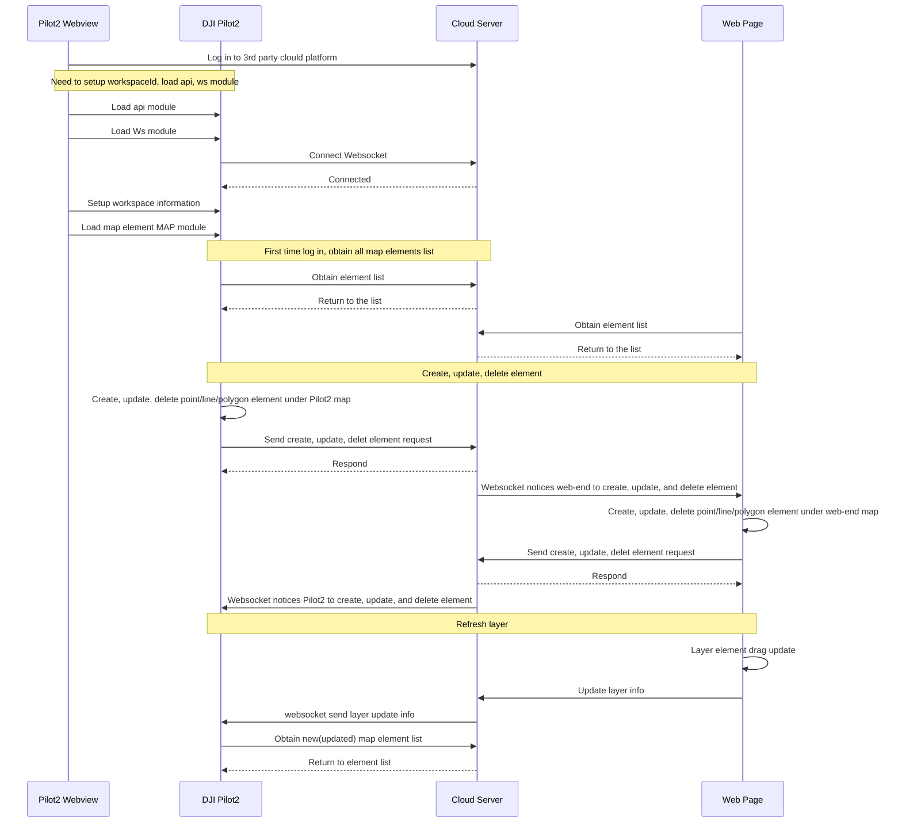

## Function Overview

The Map Elements is a function that can synchronize points, lines, and polygons from the DJI Pilot2 map to the cloud server. To achieve real-time tactical layout, it gives the commander/host the ability to share the layers with Pilot2 through the web browser. On the other side, the Pilot2 can also share the signs to the web end to help the commander/host have more information. In addition, the platform also can distribute the layers from one Pilot2 to other different Pilot2 during the mission.

*Note：*

1. Please set up the workspace. The Pilot2 only start synchronizing the workspace's elements once the the setup is complete.
2. *Different remote controller will synchronize the map elements automaticly without the transference from server end.*
3. If an aircraft connect with two remote controller A and B and only remote B has connected with server, the new point/sign/mark from the remote controller A would synchronize with remote controller B first. Then the remote controller B will upload the point to the server end.
4. *The latitude and longitude coordinates of map elements use the WGS84 coordinate system. If the Web terminal uses Baidu, AutoNavi, etc., coordinate conversion is required.*

*Legend：DJI Pilot2 Map UI*

*Legend：Web map page*

## Interactive timing diagram

## Interface Introduction

### Load Pilot2 Map Element Module

Before using the map element function, developers need to setup the workspaceId, configure the Ws module and api module, and then load the Pilot2 map module. Also, developers can consider to add the loading interface of map module in log-in phase. 

API: Refer to《**JSBridge API Reference**》-`window.djiBridge.platformLoadComponent(String name, String param)`

### Obtain Map Element List

In the first connection, Pilot2 will send out a *http* request to obtain the map element list. On the server end, it needs to synchronize the map element list to the Pilot2. Also, if it receives a layer refresh instruction from websocket, it needs the same interface to request the map element list.

Note: The list has to have the APP sharing layer, otherwise the successor element cannot be synchronized to the server.

API: Refer to《**Server API Reference-HTTPS-Map ELements-Get Map Elements**》

### New Map Element Request

When user draws a point, line or polygon on the Pilot2/Web side, it will send out a new map element request to the server end. Then the server end will respond after receiving the request.

API: Refer to《**Server API Reference-HTTPS-Map ELements-Create Map Elements**》

### Map Element Update Request

When user draws a point, line or polygon on the Pilot2/Web side, it will send out a map element update request to the server end. Then the server end will respond after receiving the request.

API: Refer to《**Server API Reference-HTTPS-Map Elements-Update Map Elements**》

### Delete Map Element Request

When user deletes a point, line or polygon on the Pilot2/Web side, it will send out a delete map element request to the server end. Then the server end will respond after receiving the request.

API: Refer to《**Server API Reference-HTTPS-Map Elements-Delete Map Elements**》

### Refresh Map Element List Push

When several elements have changed on the server end, such as drag a element on web end, the user end can be notified through websocket. The downward parameter has the layer group_id. The user end can call "*Obtain Map Element List*" to refresh the element list through *http* after receiving the ID.

API: Refer to《**Server API Reference-Websocket-Map Elements-Push Message**》

### New/Update/Delete Map Element Push

After receiving the new/update/delete map element request from Pilot2/WEB end, the server end will update the stored element and will notify all termial in the same workspace.

API: Refer to《**Server API Reference-Websocket-Map Elements-Push Message**》