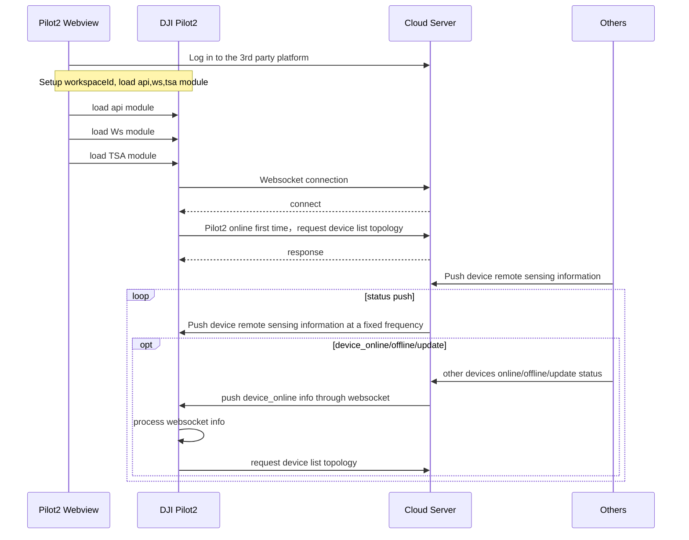

## Function Overview

TSA is a function that supports Pilot2 to display the aircraft/RC info on the map by using the device coordinate infomation which is sent by server end. Both web end and Pilot2 end will have all devices info under same workspace. It can help the communication and info sharing between all devices/Pilot2/teammates.


For example, in the following figure, Pilot2 A, Pilot2 B, DOCK A, DOCK B, Human, and other devices have pushed their information to the server through API. Once the server end receives all information, it will summarize it and push it to different Pilot2 through websocket, then Pilot2 A and Pilot2 B will have all info displayed in their APP.

 <center>        <br>     </center>

## Interactive timing diagram




## Interface Introduction

### Load Pilot2 TSA Module

Before using the TSA function, developers need to setup the workspaceId, configure the Ws module and api module, and then load the Pilot2 map module. Also, developers can consider to add the loading interface of map module in log-in phase. 

API: Refer to《**JSBridge API Reference**》-`window.djiBridge.platformLoadComponent(String name, String param)`

### Obtain Device Topology List

In the first connection, Pilot2 will send out a http request to obtain all devices list and topology list. On the server end, it needs to synchronize the device list to the Pilot2. Also, if it receives a instruction of device online/offline/update from websocket, it needs the same interface to request the update of device topology list.

API: Refer to《**Server API Reference-HTTPS-Terrain Situation Awareness-Get Device Topology List**》

### Custom Icon
The device can display custom icon by using icon_urls. If the field is defined, it will be displayed in preference to the content of the field. If not, it is displayed by default by device_model. 

```json
"icon_urls":{      
                "normal_icon_url":"resource://Pilot2/drawable/tsa_aircraft_others_normal",    // Normal status icon
                "selected_icon_url":"resource://Pilot2/drawable/tsa_aircraft_others_pressed",   // Selected status icon
            }
```

App has some built-in icons.

```
url style： resource://Pilot2/drawable/tsa_aircraft_others_normal
```

**Built-in Icon List**

| Icon                                                         | Icon_url                                        | Remark |
| ------------------------------------------------------------ | ----------------------------------------------- | ------ |
|  | resource://Pilot2/drawable/tsa_car_select       |        |
|  | resource://Pilot2/drawable/tsa_car_normal       |        |
|  | resource://Pilot2/drawable/tsa_person_select    |        |
|  | resource://Pilot2/drawable/tsa_person_normal    |        |
|  | resource://Pilot2/drawable/tsa_equipment_select |        |
|  | resource://Pilot2/drawable/tsa_equipment_normal |        |

Support online icon. Online Icon are downloaded and cached inside the App and displayed on the map at a fixed size (28dp).

```
url style：http://r56978dr7.hn-bkt.clouddn.com/tsa_equipment_normal.png
```

The icon in Pilot2 Map：

<center>        <br>     </center>

### Device Remote Sensing information Push

Server end will push all devices remote sensing information under same workspace to the Pilot2 and Pilot2 will update the status and postion of the device based on the received data.

API: Refer to《**Server API Reference-Websocket-Terrain Situation Awareness-Push Message**》

### Device Online/Offline/Update Topology Status Push

When server end has received a request of any device online/offline/topology update, it will broadcast a device online/offline/topology update push notification to Pilot2. Pilot2 will trigger *"obtain device topology list"*

API: Refer to《**Server API Reference-Websocket-Terrain Situation Awareness-Push Message**》