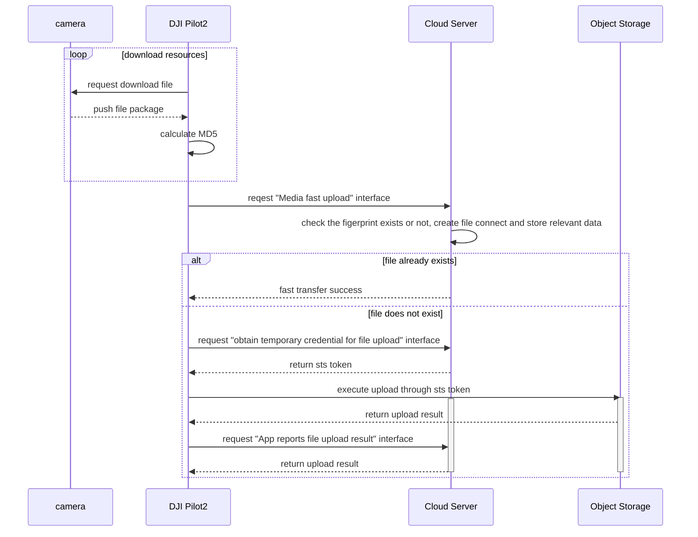

## Function Overview

The media library is the function that help Pilot2/DOCK to upload the photos/videos, downloaded from aircraft to the remote controller/dock, to the 3rd party server. Media upload function includes auto upload or manual upload. For the DOCK, it has auto upload only.

Media object storage supprt OSS and S3. The demo example is based on Aliyun OSS test, if you encounter other storage buckets can not be uploaded, please contact us.

              

## Interactive timing diagram

## Interface Introduction

### Load Media Library Module

Before using the media library module, developer need to setup the workspace ID in H5 through JSBridge, configure API module, and then load the Pilot2 media module. Also, developers can consider to add the loading interface of Media Library module in log-in phase. 

API: Refer to《**JSBridge API Reference**》-`window.djiBridge.platformLoadComponent(String name, String param)`

### Media Fast Upload

As the transfer of files may exist in the cloud of existing images, then DJI Pilot2 or dock will start the file fast transfer interface when uploading files, the server needs to check whether the file has been uploaded exists, if it exists, directly return the upload success.

API: Refer to《**Server API Reference-HTTP-Media Management-Media Fast Upload**》

### Obtain Exist File Tiny Fingerprint

For whether the file exists or not, the corresponding fingerprint verification needs to be done, but since media files vary in size, DJI provides a set of media file streamlined fingerprint generation scheme, and the server side only needs to calculate the media fingerprint information according to this scheme and return it to the DJI Pilot2 side.

API: Refer to《**Server API Reference-HTTP-Media Management-Obtain Exist File Tiny Fingerprint**》

### Obtain Temporary Credential

For each media upload, you need to obtain temporary file upload credentials from the server, so that DJI Pilot2 will bring the credentials to the object storage service for verification when uploading.

API: Refer to《**Server API Reference-HTTP-Media Management-Obtain Temporary Credential**》

### App Reports File Upload Result

After the media file transfer is finished, DJI Pilot2 will call this interface to inform the server of the corresponding media file upload result.

API: Refer to《**Server API Reference-HTTP-Media Management-App Reports File Upload Result**》

