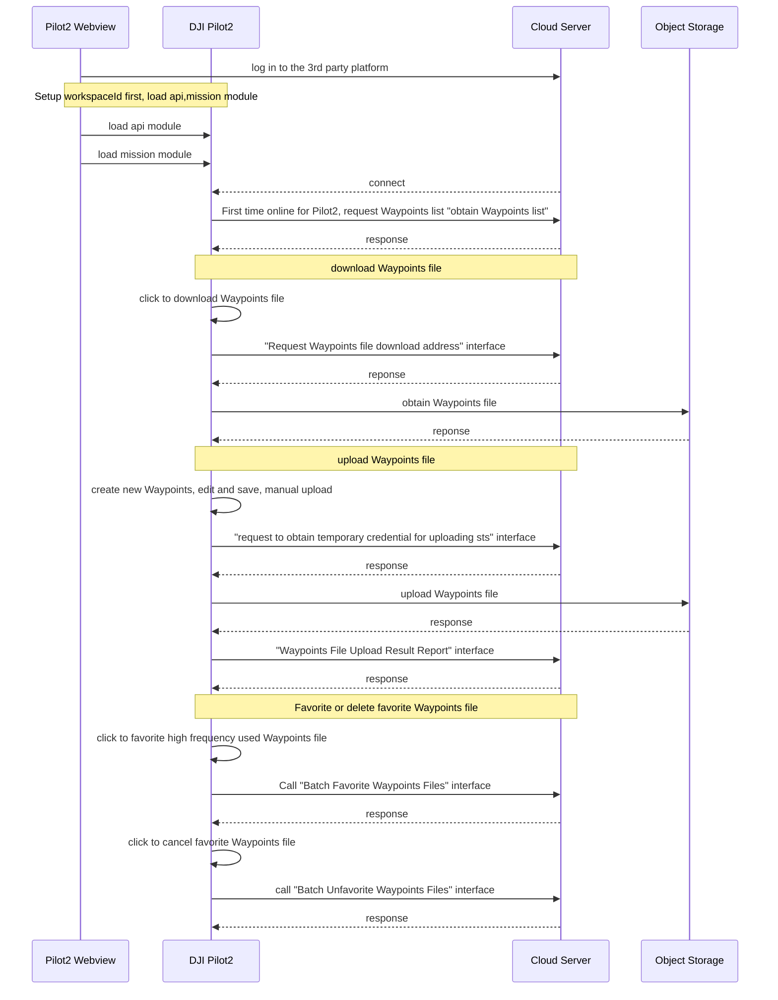

## Function Overview

Waypoints library provide an ability that the flight path can be downloaded or uploaded in the same worksapce. After logging in to the server through Pilot2, the user can obtain the waypoints list and display it in the waypoints library. In Pilot2, the waypoints existing in the cloud can be previewed directly, but when the user wants to edit the waypoints, it needs to be downloaded in Pilot2 locally and it will not affect the original waypoints in cloud. The edited waypoints needs a new name for sharing.

*Note: After editing waypoints locally, it has to give a new name for the waypoints. Otherwise, the transmission of the waypoints will fail.*

              

## Interactive timing diagram

## Interface Introduction

### Load Mission Waypoints Library Module

Before using the waypoints library module, developer need to setup the workspace ID in H5 through JSBridge, configure API module, and then load the Pilot2 mission module. Also, developers can consider to add the loading interface of mission module in log-in phase.

API: Refer to《**JSBridge API Reference**》-`window.djiBridge.platformLoadComponent(String name, String param)`

### Obtain Temporary Credential

For each waypoints file upload, you need to obtain temporary file upload credentials from the server, so that DJI Pilot2 will bring the credentials to the object storage service for verification when uploading.

API: Refer to《**Server API Reference-HTTP-Waypoints Management-Obtain Temporary Credential**》

### Obtain Waypoints List

After loading the Mission waypoints library module, DJI Pilot2 will pull the list of waypoints files from the server via http and display them in the DJI Pilot2 waypoints library.

API: Refer to《**Server API References-HTTPS-Waypoints Management-Obtain Waypoints List**》

### Obtain Waypoints File Download Address

When user clicks to download a waypoints in the DJI Pilot2 waypoints list, the DJI Pilot2 will initiate a request to get the waypoints download address.

API: Refer to《**Server API References-HTTPS-Waypoints Management-Obtain Waypoints File Download Address**》

### Obtain Duplicated Waypoints Name

DJI Pilot2 does not allow duplicate waypoints names to exist in locally edited and uploaded waypoints files, so when uploading a waypoints file, you need to call this interface first to check if there is a duplicate waypoints file name, and if there is a duplicate waypoints file name, a pop-up window will prompt the user to rename the waypoints file name.

API: Refer to《**Server API References-HTTPS-Waypoints Management-Obtain Duplicated Waypoints Name**》

### Waypoints File Upload Result Report

After the waypoints file is uploaded to the object storage service, DJI Pilot2 will report the upload result to the server side, which will perform the corresponding business operations on the result.

API: Refer to《**Server API References-HTTPS-Waypoints Management-Waypoints File Upload Result Report**》

### Batch Favorite Waypoints Files

When users need to pay special attention to waypoints files, they can click on Favorites. At the same time, the interface will be called to mark the waypoints files that need to be favorited.

API: Refer to《**Server API References-HTTPS-Waypoints Management-Batch Favorite Waypoints Files**》

### Batch Unfavorite Waypoints Files

Same function as above, to unmark the waypoints files as favorites.

API: Refer to《**Server API References-HTTPS-Waypoints Management-Batch Unfavorite Waypoints Files**》

